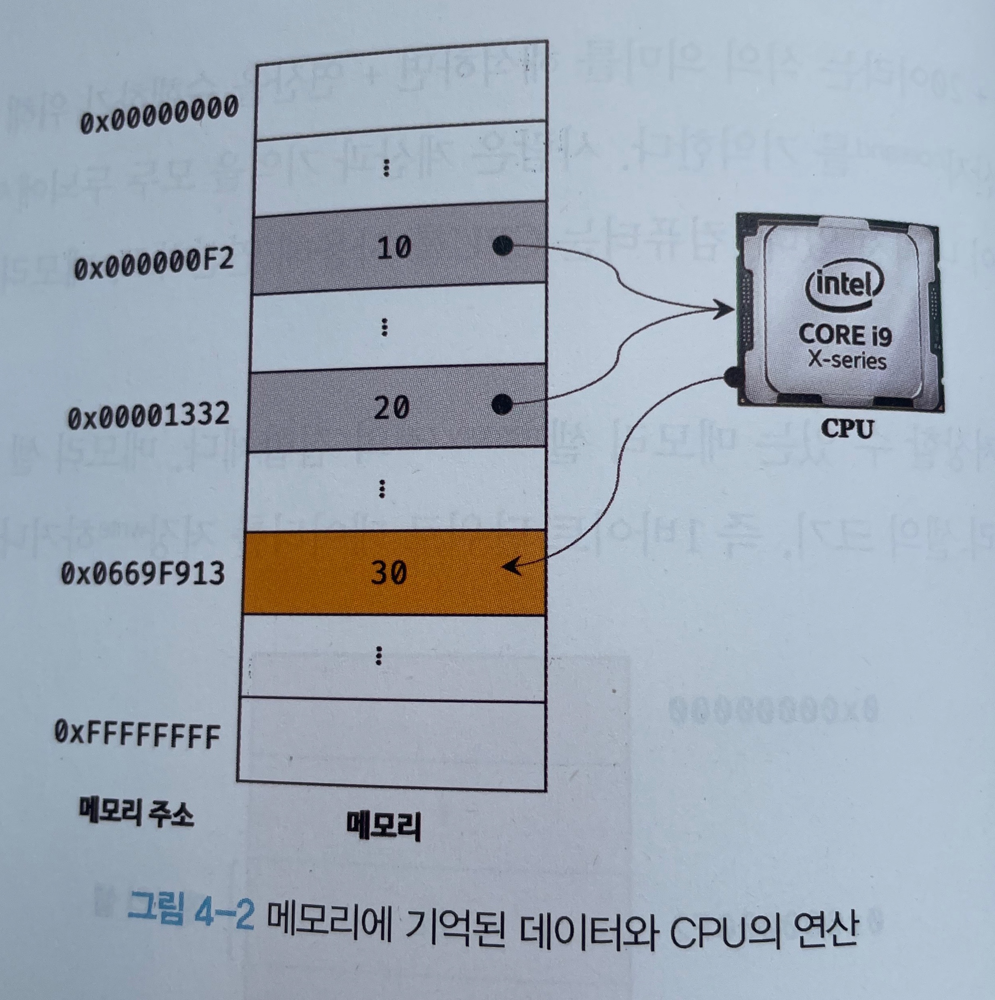
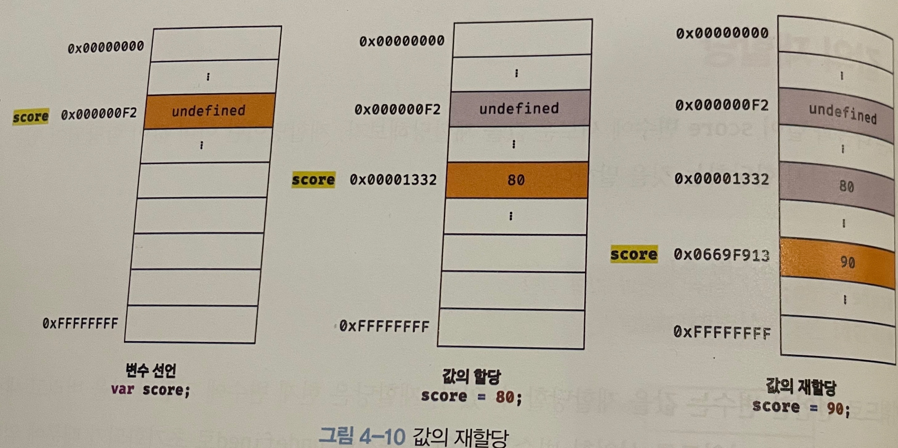

## 4.1 변수란 무엇인가? 왜 필요한가?

- 자바스크립트 엔진은 자바스크립트 코드를 해석하고 실행할 수 있어야 한다.
- 컴퓨터는 CPU를 사용해 여ㄴ산, 메모리를 사용해 데이터를 기억
- 메모리는 데이터를 저장할 수 있는 메모리 셀의 잡합체. 메모리 셀 하나의 크기는 1 바이트
- 컴퓨터는 1 바이트 단위로 데이터를 저장하거나 읽어들인다.
- 각 셀은 고유의 메모리 주소를 갖고, 메모리 주소는 메모리 공간의 위치를 나타냄
- ex: 4GB 메모리는 0부부 4,294,967,295(0x00000000 ~0xFFFFFFFF)까지의 메모리 주소를 가짐
- 10 + 20 연산의 경우, 메모리 상의 임의의 장소에 저장된 10과 20에 대한 값을 읽어서 30이라는 값을 메모리의 임의의 장소에 2진수로 저장. 그리고 CPU가 이 값을 읽어들여 연산을 수행
  
- 실제로 메모리 직접 접근하는 것은 치명적 오류 발생 가능. 따라서 자바스크립트는 개발자의 직접적인 메모리 제어를 허용하지 않음.

- **변수란?** 하나의 값을 저장하기 위해 확보한 메모리 공간 자체 또는 그 메모리 공간을 식별하기 위해 붙인 이름. 값의 위치를 가리키는 상징적인 이름
- 메모리 공간에 저장된 값을 식별할 수 있는 고유한 이름 == 변수 이름, 변수에 저장된 값 == 변수 값
- 변수에 값을 저장하는 것 == 할당

## 4.2 식별자

- 변수 이름 == 식별자라고도 함
- 식별자: 어떤 값을 구별해서 식별할 수 있는 고유한 이름
- 식별자는 식별을 위해 메모리 주소(공간)를 기억하고 있어야 함
- 식별자는 값이 아니라 메모리 주소를 기억하고 있어야 함
- 변수, 함수, 클래스 등의 이름이 모두 식별자
- 식별자는 선언에 의해 자바스크립트 엔진에 식별자의 존재를 알린다.

## 4.3 변수 선언

- 변수 선언이란 값을 저장하기 위해 메모리 공간을 확보하고 변수 이름과 확보된 메모리 공간의 주소를 연결해서 값을 저장할 수 있게 준비하는 것
- 변수 선언을 통해 확보된 메모리 공간은 할당이 해제되기 전까지 누구도 확보된 메모리 공간을 사용할 수 없도록 보호됨으로 안전
- 변수 선언 키워드는 var, let, const
- var의 단점: 블록 레벨 스코프가 아닌 함수 레벨 스코프임
- var score; 로 변수를 선언하면, 우선 메모리 상에 undefined로 값이 암묵적으로 할당되어 초기화된다.
- 자바스크립트 엔진의 변수 선언 2단계
  - 선언 단계: 변수 이름을 등록해서 자바스크립트 엔진에 변수의 존재 알림
  - 초기화 단계: 값을 저장하기 위한 메모리 공간 확보. 암묵적으로 undefined를 할당해 초기화
  - 선언을 하지 않은 식별자에 접근하면 ReferenceError(참조 에러) 발생.

## 4.4 변수 선언의 시점과 변수 호이스팅

```javascript
console.log(score); // undefined
var score;
```

- 변수의 선언보다 참조가 앞에 있기 때문에 참조 에러가 나야할 거 같지만, undefined가 출력됨
- 그 이유? -> **변수 선언이 소스코드가 한 줄씩 순차적으로 실행되는 시점(런타임)이 아니라 그 이전 단계에서 먼저 실행되기 때문** -> 변수 선언이 런타임보다 먼저 실행되기 때문
- 자바스크립트 엔진은 변수 선언이 소스코드의 어디에 있든 상관없이 다른 코드보다 먼저 실행.
- 변수 선언문이 코드의 선두로 끌어 올려진 것처럼 동작하는 자바스크립트 고유의 특징 == **변수 호이스팅!!!**
- var, let, const, class, function 등 모든 식별자가 다 호이스팅 됨

## 4.5 값의 할당

- 변수 선언 후, 값을 할당하는 것과 선언과 동시에 값을 할당하는 것은 정확히 동일하게 동작
- 다만 변수 선언과 값의 할당의 실행 시점이 다름
- **변수 선언은 런타임 이전에 먼저 실행되지만, 값의 할당은 런타임에 실행됨**
- 변수를 선언하고 값을 할당하면
  - 메모리 상의 공간을 확보하고 그 공간을 undefined로 초기화
  - 그 이후에 그곳에 할당값으로 저장

## 4.6 값의 재할당

- 재할당: 현재 변수에 저장된 값을 버리고 새로운 값을 저장하는 것.
- 엄밀히 말하면 var을 통한 값 할당도 처음에는 undefined였다가 값으로 재할당하는 것이라고 볼 수 있음
- 상수: 한번 정해지면 변하지 않는 값
  
- **값을 재할당하면, 기존에 저장되어 있던 메모리 공간에 값을 덧입히는 게 아니라 새로운 메모리 공간을 확보하고, 그 메모리 공간에 새로운 값을 저장한다.**
- 기존의 undefined와 80 값은 가비지 콜렉터에 의해 메모리에서 자동 해제됨

### 4.7 식별자 네이밍 규칙

- 변수는 쉼표로 구분해 하나의 문에서 여러 개를 한번에 선언할 수 있지만, 가독성이 나빠지므로 권장하지 않음
  ```javascript
  var person, $elem, _name, val; // 비권장
  ```
- 알파벳 이외의 문자도 비권장
- 코드 전체의 가독성을 논ㅍ이려면 카멜 케이스와 파스칼 케이스를 따르는 것이 유리함
