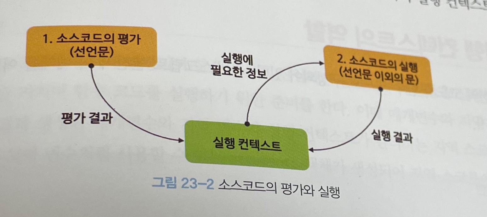
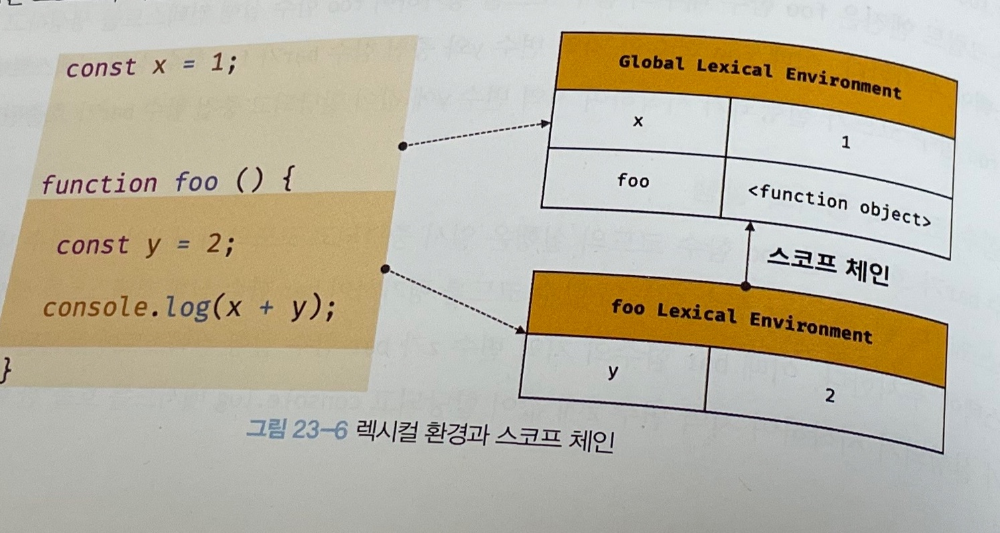
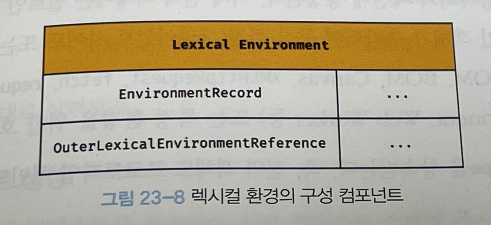

## 23.1 소스코드의 타입

- 다음 4가지 타입의 소스코드는 실행 컨텍스트를 생성함

  - 전역 코드: 전역에 존재하는 소스코드.
  - 함수 코드: 함수 내부에 존재하는 소스코드. 함수 내부에 중첩된 함수, 클래스 등의 내부 코드는 포함하지 않음.
  - eval 코드: 빌트인 전역 함수인 eval 함수에 인수로 전달되어 실행되는 소스코드.
  - 모듈 코드: 모듈 내부에 존재하는 소스코드를 의미. 모듈 내부의 함수, 클래스 등의 내부 코드는 포함하지 않음.

- 위 4가지 타입에 따라 실행 컨텍스트를 생성하는 과정과 관리 내용이 다름
  - 전역 코드
    - 전역 코드는 전역 변수를 관리하기 위해 최상위 스코프인 전역 스코프 생성.
    - var 키워드로 선언된 변수, 함수 선언문으로 정의된 전역 함수를 전역 객체의 프로퍼티와 메서드로 바인딩.
    - **전역 실행 컨텍스트**가 생성
  - 함수 코드
    - 지역 스코프를 생성, 지역 변수, 매개변수, arguments 객체 관리.
    - 지역 스코프를 전역 스코프에서 시작하는 스코프 체인의 일원으로 연결.
    - **함수 실행 컨텍스트**가 생성됨
  - eval 코드
    - strict mode에서 자신만의 독자적인 스코프 생성.
    - eval 코드가 평가되면 **eval 실행 컨텍스트** 생성
  - 모듈 코드 - 모듈 별로 독립적인 모듈 스코프를 생성.
    모듈 코드가 평가되면 **모듈 실행 컨텍스트** 생성.
    <br/><br/>

## 23.2 소스코드의 평가와 실행

- 자바스크립트 엔진은 소스코드를 "소스코드의 평가"와 "소스코드의 실행" 두 개의 과정으로 나누어 처리
- 소스코드 평가 과정
  - 실행 컨텍스트를 생성. 변수, 함수 등의 선언문만 먼저 실행하여 생성된 변수, 함수 식별자를 키로 실행 컨텍스트가 관리하는 스코프에 등록.
- 소스코드 실행 과정
  - 소스코드의 순차적인 실행. 런타임의 시작
  - 소스코드 실행에 필요한 정보, 즉, 변수나 함수의 참조를, 실행 컨텍스트가 관리하는 스코프에서 검색해서 취득한다.
  - 소스코드 실행의 결과를 다시 실행 컨텍스트가 관리하는 스코프에 등록
    

요약: 소스코드 평가 과정의 결과물을 실행 컨텍스트가 관리하는 스코프에 등록. 소스코드를 실행하면, 소스코드 실행에 필요한 정보를 스코프에서 취득. 소스코드의 실행 결과를 다시 스코프에 등록

- ex
  ```javascript
  var x;
  x = 1;
  ```
- 소스코드 평가과정에서 변수 x를 실행 컨텍스트가 관리하는 스코프에 undefined의 형태로 초기화
- 소스코드 평가가 끝나고 소스코드 실행이 수행됨. 변수 x에 1이라는 값이 할당됨
- 값이 할당되기 위해서는 스코프에 x가 등록되어 있는지 확인해야 함. x가 등록되어 있다는 것이 확인이 되면, x에 1을 할당 후, 할당 결과를 실행 컨텍스트에 등록 및 관리함.
  <br/><br/>

## 23.3 실행 컨텍스트의 역할

```javascript
// 전역 변수 선언
const x = 1;
const y = 2;

// 함수 정의
function foo(a) {
  // 지역 변수 선언
  const x = 10;
  const y = 20;

  // 메서드 호출
  console.log(a + x + y); // 130
}

// 함수 호출
foo(100);

// 메서드 호출
console.log(x + y); // 3
```

- 자바스크립트 엔진이 위 예제를 평가하고 실행하는 방법

1. 전역 코드 평가
   - 전역 코드 실행을 위한 전 단계. 선언문만 먼저 실행됨
   - 따라서 변수 선언문과 함수 선언문이 먼저 실행됨
   - 그 결과로 생성된 전역 변수와 전역 함수가 전역 스코프에 등록됨
   - var 키워드로 선언된 전역 변수와 함수 선언문으로 정의된 전역 함수는 전역 객체의 속성과 메서드가 됨
2. 전역 코드 실행
   - 평가가 끝나면 런타임 시작. 전역 코드의 순차적 실행
   - 전역 변수에 값이 할당되고 함수가 호출됨
   - **함수가 호출되면 순차적으로 실행되던 전역 코드의 실행을 일시중단.**
   - 코드 실행 순서를 변경하여 함수 내부로 진입
3. 함수 코드 평가
   - 함수 내부로 진입 시, 함수 내부 코드에 대한 평가가 이루어짐. 함수 코드 실행 준비
   - 매개변수와 지역 변수 선언문이 먼저 실행
   - 함수 내부 코드 평가의 결과로 생성된 결과물이 지역 스코프에 등록됨
   - 또한 함수 내부에서 지역 변수처럼 사용할 수 있는 arguments 객체가 생성되어 지역 스코프에 등록되고 this 바인딩도 결정됨
4. 함수 코드 실행
   - 함수 코드의 순차적 실행. 매개변수와 지역변수에 값이 할당됨. console.log(a + x + y) 메서드의 실행
   - console.log의 실행을 위해 console을 스코프 체인을 통해 검색(전역 객체의 프로퍼티로 존재함을 발견)
   - log를 console 객체의 프로토타입 체인을 통해 검색.
   - 그 이후에 메서드에 인수로 전달된 a + x + y가 평가됨
   - a, x, y 식별자를 스코프 체인을 통해 검색
   - 함수 코드의 실행이 종료되면, 함수 호출 이전으로 돌아가 전역 코드 실행을 계속함.

- 코드의 실행을 위해서는 스코프를 구분하여 식별자와 바인딩 된 값이 관리되어야 하고, 중첩 관계에 의해 스코프 체인을 형성하여 식별자를 검색할 수 있어야 하고, 전역 객체의 프로퍼티도 검색이 가능해야 함
- **즉, 코드가 실행되기 위해서는 스코프, 식별자, 코드 실행 순서 등의 관리가 필요**

### 코드 실행 조건(실행 컨텍스트의 역할과 조건)

1. 선언에 의해 생성된 모든 실별자를 스코프를 통해 구분하여 등록, 상태 변화를 지속적으로 관리할 수 있어야 함.
2. 스코프는 중첩 관계에 의해 스코프 체인을 형성해야 함. 스코프 체인을 통해 상위 스코프로 이동하여 식별자를 검색할 수 있어야 함
3. 함수 실행 등의 이유로 현재 실행중인 코드의 실행 순서를 변경할 수 있어야 하고, 다시 되돌아갈 수 있어야 함.

- **즉, 실행 컨텍스트는 식별자를 등록하고 관리하는 스코프와 코드 실행 순서 관리를 구현한 내부 메커니즘. 모든 코드는 실행 컨텍스트를 통해 실행되고 관리됨**
- 실행 컨텍스트는 자바스크립트 소스코드 **평가 과정** 중에 생성됨
- 식별자와 스코프는 실행 컨텍스트의 **렉시컬 환경**으로 관리.
- 코드 실행 순서는 **실행 컨텍스트 스택**으로 관리
  <br/><br/>

## 23.4 실행 컨텍스트 스택

```javascript
const x = 1;
function foo() {
  const y = 2;
  function bar() {
    const z = 3;
    console.log(x + y + z);
  }
  bar();
}
foo(); // 6
```

- 위 코드는 전역 코드와 함수 코드로 구성
- 자바스크립트 엔진은 먼저 전역 코드를 평가하여 전역 실행 컨텍스트를 생성
- 함수가 호출되면 함수 코드를 평가하여 함수 실행 컨텍스트 생성
- 실행 컨텍스트는 코드 평가 과정 중에 생성됨
- 이 때 생성된 실행 컨텍스트는 스택 자료구조로 관리됨(=== 실행 컨텍스트 스택)

1. 전역 코드의 평가와 실행
   - 자바스크립트 엔진은 먼저 전역 코드를 평가, 전역 실행 컨텍스트 생성, 전역 실행 컨텍스트를 실행 컨텍스트 스택에 적재.
   - 전역 변수 x와 전역 함수 foo를 전역 실행 컨텍스트에 등록
   - 이후 코드 실행. 전역 변수 x에 값이 할당. 전역 함수 foo 호출됨
2. foo 함수 코드의 평가와 실행
   - 전역 함수 foo 호출 시, 전역 코드의 실행 잠시 중단
   - 코드의 제어권이 foo 함수 내부로 이동
   - 자바스크립트 엔진이 foo 함수 내부의 코드를 평가
   - foo 함수 실행 컨텍스트 생성, 실행 컨텍스트 스택에 foo 함수 실행 컨텍스트 적재
   - foo 함수의 지역 변수인 y와 중첩 함수인 bar가 foo 함수 실행 컨텍스트에 등록
   - 이후 foo 함수가 실행되어 y에 값 할당, bar 함수 호출
3. bar 함수 코드의 평가와 실행
   - bar 함수가 실행(호출)되면(bar(); 부분) foo 함수 실행 코드가 잠시 중단
   - 코드의 제어권이 bar 함수 내부로 이동
   - 자바스크립트 엔진이 bar 함수 내부의 코드를 평가
   - bar 함수 실행 컨텍스트 생성. bar 함수 실행 컨텍스트를 실행 컨텍스트 스택에 적재
   - bar 함수의 지역 변수인 z가 bar 함수 실행 컨텍스트에 등록되고, 코드 실행
   - z에 값이 할당되고, console.log(x + y + z) 실행
   - bar 함수 실행 컨텍스트는 x와 y에 대한 정보가 없기에 스코프 체이닝을 통해 상위 실행 컨텍스트를 뒤져서 x(1)와 y(2)에 대한 정보를 찾아냄
   - 6 출력하고 bar 함수 실행 컨텍스트 종료, 스택에서 bar 함수 실행 컨텍스트 제거
4. foo 함수 코드로 복귀
   - foo 함수는 더 이상 실행할 코드가 없기에 foo 함수 실행 컨텍스트 종료
   - foo 함수 실행 컨텍스트가 스택에서 제거
5. 전역 코드로 복귀
   - 제어권이 다시 전역 코드로 이동
   - 더 이상 실행할 전역 코드가 남아있지 않아서 전역 실행 컨텍스트도 실행 컨텍스트 스택에서 제거됨.
   - 실행 컨텍스트 스택은 아무것도 남아있지 않게 됨.

- 즉, **실행 컨텍스트 스택은 코드의 실행과 순서를 관리**한다.
- 소스코드가 평가되면 실행 컨텍스트가 생성되고, 실행 컨텍스트 스택의 최상단에 쌓임
- 즉, 실행 컨텍스트 스택의 최상단에 존재하는 실행 컨텍스트는 항상 "현재 실행 중인 코드의 실행 컨텍스트"임
- 이를 **실행중인 실행 컨텍스트(running execution context)**라고 부름
  <br/><br/>

## 23.5 렉시컬 환경

- 렉시컬 환경이란?

  - 식별자와 식별자에 바인딩된 값.
  - 상위 스코프에 대한 참조를 기록하는 자료구조.
  - **실행 컨텍스트를 구성하는 컴포넌트**
  - 실행 컨텍스트 스택 -> 코드의 실행과 순서를 관리, 보장
  - 렉시컬 환경 -> 스코프와 식별자를 관리
    

- 렉시컬 환경은 키와 값을 갖는 객체 형태의 스코프를 생성
- 식별자를 키로 등록하고, 식별자에 바인딩 된 값을 관리함
- 즉, 렉시컬 환경은 스코프를 구분하여 식별자를 등록하고 관리하는 저장소 역할
- 실행 컨텍스트는 "렉시컬 환경" 컴포넌트와 "변수 환경" 컴포넌트로 구성됨
- 생성 초기에는 렉시컬 환경 컴포넌트와 변수 환경 컴포넌트가 동일한 하나의 렉시컬 환경 참조
- 특별한 상황을 만나면, 위 두 컴포넌트가 참조하는 내용이 달라질 수도 있지만, 이 책에서는 두 컴포넌트를 렉시컬 환경으로 통일하여 설명

- 렉시컬 환경은 EnvironmentRecord와 OuterLexicalEnvironmentReference, 두 개의 컴포넌트로 구성됨.
  
- 환경 레코드(Environment Record)
  - 스코프에 포함된 식별자 등록
  - 등록된 식별자에 바인딩된 값을 관리하는 저장소
  - 소스코드의 타입에 따라 관리하는 내용에 차이있음
- 외부 렉시컬 환경에 대한 참조(Outer Lexical Environment Reference)
  - 상위 스코프를 가리킴
  - 상위 스코프란? -> 외부 렉시컬 환경. 즉, 해당 실행 컨텍스트를 "생성"한 소스코드를 포함하는 상위 코드의 렉시컬 환경
  - 단방향 링크드 리스트 스코프 체인 자료구조 형태
    <br/><br/>

## 23.6 실행 컨텍스트의 생성과 식별자 검색 과정

- 아래 코드의 실행 컨텍스트의 생성과 코드 실행 결과 관리되는 과정

```javascript
var x = 1;
const y = 2;

function foo(a) {
  var x = 3;
  const y = 4;

  function bar(b) {
    const z = 5;
    console.log(a + b + x + y + z);
  }
  bar(10);
}
foo(20); // 42
```

### 23.6.1 전역 객체 생성

- 전역 객체는 전역 코드가 평가되기 이전에 생성됨

### 23.6.2 전역 코드 평가

- 소스코드가 로드되면 자바스크립트 엔진은 전역 코드를 평가함.
- 전역 코드의 평가 순서
  1. 전역 실행 컨텍스트 생성
  2. 전역 렉시컬 환경 생겅
  - 2.1. 전역 환경 레코드 생성
    - 2.1.1 객체 환경 레코드 생성
    - 2.1.2 선언적 환경 레코드 생성
  - 2.2. this 바인딩
  - 2.3. 외부 렉시컬 환경에 대한 참조 결정

1. 전역 실행 컨텍스트 생성
   - 비어있는 전역 실행 컨텍스트 생성하여 실행 컨텍스트 스택에 푸시
   - 이 때 전역 실행 컨텍스트는 실행 컨텍스트 스택의 최상위, 즉, 실행 중인 실행 컨텍스트가 된다.
2. 전역 렉시컬 환경 생성
   - 전역 실행 컨텍스트 안에서 전역 렉시컬 환경 생성 및 전역 실행 컨텍스트에 이를 바인딩 함
     - 2.1. 전역 환경 레코드 생성
       - 저전역 환경 레코드는 전역 렉시컬 환경을 구성함
       - 전역 환경 레코드는 전역 변수를 관리하는 전역 스코프 등을 제공
         - 2.1.1. 객체 환경 레코드 생성
           - 전역 코드 평가 과정에서 var 키워드로 선언한 전역 변수와 함수 선언문으로 정의된 전역 함수는 전역 함수는 전역 환경 레코드의 객체 환경 레코드에 연결된 **BindingObject를 통해 전역 객체의 프로퍼티와 메서드가 됨.**
           - var 키워드로 선언된 전역 변수와 함수 선언문으로 정의된 전역 함수가 전역 객체의 프로퍼티와 메서드가 됨
           - 식별자(window) 없이 전역 객체의 프로퍼티를 참조할 수 있는 매커니즘이 이 binding 덕분에 가능한 것. (window.alert가 아니라 그냥 alert만 해도 코드가 동작하는 이유)
         - 2.1.2 선언적 환경 레코드 생성
           - let, const 키워드로 선언한 전역변수는 선언적 환경 레코드에 등록되고 관리됨
           - ES6의 let, const 키워드로 선언한 전역 변수는 전역 객체의 프로퍼티가 되지 않고, 개념적인 블록(== 전역 환경 레코드의 선언적 환경 레코드) 내에 존재하게 된다.
           - 즉, let, const와 같이 선언된 변수는 전역 객체의 프로퍼티가 되지 않기 때문에 window.y 같은 전역 객체의 프로퍼티 참조가 불가능
           - let과 const는 "선언 단계"와 "초기화 단계"가 분리되어 진행되기 때문에 런타임 환경(초기화 단계)의 변수 선언문에 도달하기 전까지 값을 알 수 없는 "일시적 사각지대"(uninitialized) 상태에 빠지게 됨.
           - uninitialized 단계는 값이 바인딩 되지 않은 상태
     - 2.2 this 바인딩
       - 전역 환경 레코드 내부의 [GlobalThisValue] 슬록에 this가 바인딩 됨.
       - 일반적인 전역 코드에서의 this는 전역 객체를 가리킴. 즉, [GlobalThisValue] 내부 슬롯에는 전역 객체가 바인딩 됨.
       - 전역 코드에서 this를 참조하면 [GlobalThisValue] 내부 슬롯에 바인딩 되어 있는 객체가 반환된다.
     - 2.3 외부 렉시컬 환경에 대한 참조 결정
       - 현재 평가중인 소스코드는 전역 코드이기 때문에 외부 렉시컬 환경에 대한 참조는 nulldlek.

### 23.6.3 전역 코드 실행

- 전역 코드가 순차적으로 실행되기 시작.
- 전역 변수 x, y에 값이 할당되고, foo 함수가 호출됨.
- 변수 할당문 또는 함수 호출문을 실행하려면 먼저 변수 또는 함수 이름이 "선언된 식별자"인지 확인해야 함.
  - 식별자는 스코프 별로 동일한 이름을 가질 수 있기에, 어떤 스코프의 식별자를 참조해야 하는지 결정해야 함 -> "식별자 결정"
- 식별자 결정: 식별자 결정을 위한 식별자 검색을 할 때, 실행 중인 실행 컨텍스트에서 식별자를 검색한다.
  - 선언된 식별자는 실행 컨텍스트의 렉시컬 환경의 환경 레코드에 등록되어 있음
- 전역 실핼 컨텍스트의 전역 렉시컬 환경에서 식별자 x, y, foo를 검색. 없다면 스코프 체이닝을 통해 상위 스코프를 탐색. 하지만 전역 실행 컨텍스트는 최상위 스코프이므로, 전역 컨텍스트에 참조할 수 있는 식별자가 없다면 _참조 에러(Reference Error)_ 발생

### 23.6.4 foo 함수 코드 평가

- foo 함수가 호출되면 전역 코드의 실행을 일시 중단하고 foo 함수 내부로 코드의 제어권이 이동함.
- 그리고 함수 코드를 평가하기 시작
- 함수 코드 평가 순서
  - 1. 함수 실행 컨텍스트 생성
  - 2. 함수 렉시컬 환경 생성
    - 2.1 함수 환경 레코드 생성
    - 2.2 this 바인딩
    - 2.3 외부 렉시컬 환경에 대한 참조 결정

1. 함수 실행 컨텍스트 생성

- 함수 실행 컨텍스트는 함수 렉시컬 환경이 완성된 다음 실행 컨텍스트 스택에 푸시됨.
- 이 때, foo 함수 실행 컨텍스트는 실행 컨텍스트 스택의 최상위(== 실행중인 실행 컨텍스트)가 됨

2. 함수 렉시컬 환경 생성

- foo 함수 렉시컬 환경 생성 및 이를 foo 함수 실행 컨텍스트에 바인딩
  2.1. 함수 환경 레코드(함수 렉시컬 환경을 구성하는 컴포넌트 중 하나) 생성

  - 함수 환경 레코드는 매개변수, arg 객체, 함수 내부에서 선언한 지역 변수와 중첩 함수를 등록하고 관리
    2.2. this 바인딩
  - [ThisValue] 슬록에 전역 객체가 바인딩 됨.
  - foo 함수 내부에서 this를 참조하면 함수 환경 레코드의 [ThisValue] 내부 슬롯에 바인딩 되어 있는 객체가 반환이 됨.
    2.3. 외부 렉시컬 환경에 대한 참조 결정
  - 외부 렉시컬 환경에 대한 참조에 전역 렉시컬 환경의 참조가 할당됨.

- 자바스크립트는 함수를 어디서 호출했는지가 아니라 어디에 정의했는지에 따라 상위 스코프를 결정한다.

### 23.6.5 foo 함수 코드 실행

- foo 함수 소스코드의 순차적 실행. 지역변수 x, y에 값이 할당되고, bar 함수가 실행됨
- 식별자 결정을 위해 실행 중인 실행 컨텍스트(foo 함수 실행 컨텍스트)의 렉시컬 환경에서 식별자를 검색하기 시작.
- foo 함수 실행 컨텍스트에서 적절한 식별자가 없는 경우, 외부 렉시컬 환경에 대한 참조가 가리키는 렉시컬 환경으로 이동하여 식별자 검색
- 허나 foo 함수 실행 컨텍스트에서 각 식별자(x, y)를 찾을 수 있음. 그리고 식별자와 값을 바인딩

### 23.6.6 bar 함수 코드 평가

- 현재 foo 함수 실행 컨텍스트가 생성되었고, foo 함수 코드를 실행중..
- 지금 현재 코드의 실행 위치는 bar 함수가 호출되기 직전.

```javascript
var x = 1;
const y = 2;

function foo(a) {
  var x = 3;
  const y = 4;

  function bar(b) {
    const z = 5;
    console.log(a + b + x + y + z);
  }
  bar(10); // <- 여기 직전
}
foo(20);
```

- bar 함수가 호출되면 bar 함수 내부로 코드의 제어권이 이동함
- 그리고 bar 함수 코드를 평가하기 시작

### 23.6.7 bar 함수 코드 실행

- 런타임이 시작되어 VAR 함수의 소스코드가 순차적으로 실행되기 시작.
- 매개변수에 인수가 할당, 변수 할당문이 실행되어 지역 변수 z에 5가 할당.
- 그리고 console.log(a + b + x + y + z)가 실행됨.

1. consoLe 식별자 검색
   - console 식별자를 스코프 체인 안에서 검색하는데, 현지 실행 컨텍스트에서 외부 실행 컨텍스트로 위로 올려가면서 탐색하는 순서
   - console 식별자는 전역 렉시컬 환경에서 발견. 객체 환경 레코드의 BindingObject를 통해 전역 객체에서 찾을 수 있음.
2. log 메서드 검색
   - console 식별자에 바인딩 된 객체에서 log 매서드를 검색
3. 표현식 a + b + x + y + z의 평가
   - 각각의 식별자 a, b, x, y, z를 각각의 스코프 체인에서 검색 후, 해당되는 값을 더한다.
   - a: foo 함수 렉시컬 환경에서
   - b: bar 함수 렉시컬 환경에서
   - x, y: foo 함수 렉시컬 환경에서
   - z: bar 함수 렉시컬 환경에서 각각 찾은 후, 계산
4. console.log 메서드 호출되어 값 출력

### 23.6.8 bar 함수 코드 실행 종료

- console.log 메서드가 종료된 후, bar 함수 코드의 실행 종료.
- 이때 실행 컨텍스트 스택에서 bar 함수 실행 컨텍스트가 pop 되어 제거됨
- 아까 중단됐던 foo 함수 실행 컨텍스트가 다시 실행됨
- _bar 함수 실행 컨텍스트가 소멸되었다 하더라도 만약 bar 함수 렉시컬 환경을 누군가 참조하고 있다면 bar 함수 렉시컬 환경은 소멸하지 않는다._

### 23.6.9 foo 함수 코드 실행 종료

- foo 함수 코드의 실행 종료 및 foo 함수 실행 컨텍스트가 pop 되어 제거.
- 전역 실행 컨텍스트가 실행 중인 "실행 컨텍스트"가 됨.

### 23.6.10 전역 코드 실행 종료

- 전역 코드에서 실행할 것이 남아있지 않다면 전역 실행 컨텍스트도 실행 컨텍스트에서 pop 되어 제거됨
- 따라서 실행 컨텍스트 스택에는 아무것도 남아있지 않게 됨.

## 23.7 실행 컨텍스트와 블록 레벨 스코프

- var 키워드로 선언한 변수 -> 함수 레벨 스코프(오로지 함수의 코드 블록만 지역 스코프로 인정)
- let, const 키워드로 선언한 변수 -> 모든 코드 블록(if, for, whil등)을 지역 스코프로 인정
  ```javascript
  let x = 1;
  if (true) {
    let x = 10;
    console.log(x); // 10
  }
  console.log(x); // 1
  ```
- let으로 선언한 변수는 블록 레벨 스코프이기 때문에 if문 안에 x는 렉시컬 환경을 새롭게 생성하여 기존의 전역 렉시컬 환경을 교체한다.(if 뿐 아니라 모든 블록문에도 적용됨)
