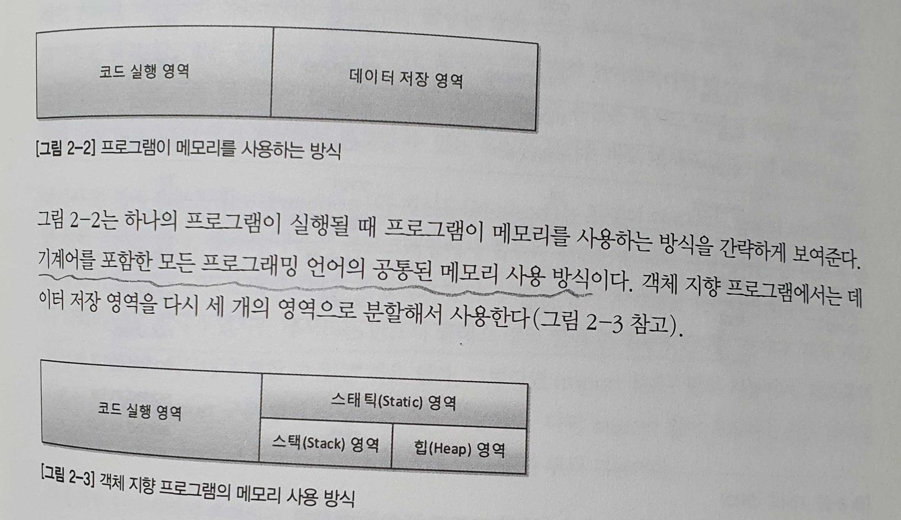

## 1. 사람을 사랑한 기술

#### 1-1. 신기술은 이전 기술의 어깨를 딛고

    - 신기술은 갑자기 하늘에서 뚝 떨어지는 것이 아니라 이전 기술의 어깨를 디딤돌 삼아 이전 기술을 거름 삼아 새로운 처학과 기법을 더해 나타난다.

    - 스프링은 과거에서 현재까지의 프로그래밍 발전사

    - 스프링을 학습하려면 이전 기술들을 마스터 해야 하는가? -> NO! 그저 이전 기술의 어깨를 딛기만 하면 됨.

#### 1-2. 기계어에서 객체 지향 프로그래밍 언어로

    - 프로그래밍 언어의 역사는 기계어에서 객체 지향 프로그래밍 언어로 진일보하게 발전해왔다.

    - 제일 초기의 프로그래밍 언어인 기계어는 0과 1로 프로그램을 작성했다. 최초의 프로그래머들은 키보드, 모니터, 마우스 없이 프로그래밍 한 것은 덤.

    - 어셈블리어: "기계어의 명령들을 일상 용어로 표현하고 이걸 기계가 알 수 있는 기계어로 번역하게 하면 어떨까?" 라는 관점에서 만들 최초의 인간 지향적 언어. 기계어 명령어와 일상 용어를 일대일로 매칭되는 코드표(어셈블리)를 생성. 허나 CPU 별로 기계어가 다르기 때문에 CPU 마다 어셈블리어도 달랐다. 게다가 각 어셈블리어들은 호환성이 없었기 때문에 각각의 어셈블리어를 별도로 학습해야하는 불편함도 있었다.

    - C 언어: C언어의 등장으로 소스 파일을 단 하나만 만들면 됨(싱글 소스). 기존에는 프로그램의 소스 파일을 각 기계의 종류만큼 만들어야 했음. C언어의 등장으로 하나의 소스 파일을 각 기계에 맞는 컴파일러로 컴파일만 하면 각 기계에 맞는 기계어 목적 파일이 만들어짐.

    - C++: C 언어에 객체 지향의 개념을 도입한 언어.

    - JAVA: 진정한 객체 지향 언어.  컴파일러를 기종별로 따로 구매해두지 않아도 됨. 자바 소스를 다른 기종의 컴퓨터에서 실행하기 위해 목적 파일인 오브젝트 파일 + 각 기종의 컴퓨터 운영체제에 해당하는 JRE가 설치되어 있으면 됨.

    - 객체 지향 방법론은 이름 그대로 방법론이며, 객체 지향을 기반으로 개발된 C++, JAVA, Spring 등을 알기 위해서는 객체 지향에 대한 깊은 이해는 필수 불가결하다

## 2. 자바와 절차적/ 구조적 프로그래밍

#### 2-1. 자바 프로그램의 객발과 구동

    - 현실 세계예서 컴퓨터를 구동하기 위해서는 물리적 컴푸터인 하드웨어와 운영체제, 그리고 그 위에서 구동될 소프트웨어가 필요함. + 소프트웨어를 개발할 수 있는 개발도구

    - 소프트웨어 개발 도구 -> JDK - 자바 개발 도구(JVM용 소프트웨어 개발 도구)

    - 운영체제 -> JRE - 자바 실행 환경(JVM용 OS)

    - 하드웨어(물리적 컴퓨터) -> JVM(Java Virtual Machine) 자바 가상 기계. 가상의 컴퓨터

    - 프로그램이 메모리를 사용하는 방식 -> 코드 실행 영역과 데이터 저장 영역으로 구성

    - 데이터 저장 영역을 다시 세 개의 영역으로 분할해서 사용.(스태틱 영역, 스택 영역, 힙  영역)



#### 2-2. 다시 보는 main() 메서드: 메서드 스택 프레임

    - 자바에서 main 메서드안의 System.out.println을 실행할 때, 메모리에서는 무슨 일이 일어날까?

    - JRE는 프로그램 안에 main 메서드가 있는지 확인한다.

    - main 메서드의 존재가 확인되면, JRE는 프로그램 실행을 위한 사전 준비에 착수

    - JVM을 부팅하여 목적 파일을 JVM에서 실행.

    - println을 실행하기 위해 java.lang 패키지를 메모리의 스태틱 영역에 가져다 놓음.(System.out.println 메서드를 실행하기 위한 사전 준비)

    - 개발자가 작성한 모든 클래스와 패키지를 스태틱 영역에 가져다 놓음

    - main 메서드의 스택 프레임이 스택 메모리 영역에 할당됨.

    - 메서드의 인자 args를 저장할 변수 공간을 스택 프레임의 맨 밑에 확보해서 변수 공간을 할당한다.

    - 닫는 중괄호를 만나면 스택 프레임이 소멸된다.

    - main 메서드가 끝나면 JRE는 JVM을 종료하고, JRE 자체도 운영체제 상의 메모리에서 사라짐

#### 2-3. 전역 변수와 메모리

    - 두 메서드 사이에 값을 공유하기 위해서 전역 변수를 사용함.

    - 자바 코드에서 static 키워드가 붙은 변수는 메모리에서 스태틱 영역에 변수 공간이 할당된다.

    - 따라서 스택 메모리의 스택 프레임 안에서 스태틱 영역에 존재하는 변수 값들을 전역적으로 가져다가 쓸 수 있다.

    - 프로젝트와 코드의 규모가 커지면서 여러 메서드에서 전역 변수의 값을 변경하기 시작하면 메모리로 전역 변수를 추적하지 않는 이상, 전역 변수에 저장돼 있는 값을 파악하기 쉽지 않기 때문에 전역 변수의 사용을 지양한다.

    - 따라서 전역 변수의 사용은 전역적으로 사용하는 변하지 않는 값(상수)를 사용할 때, 주로 사용하는 것이 바람직하다(ex: Math 클래스의 PI 값)

#### 2-4. 멀티 스레드 / 멀티 프로세스의 이해

    - 멀티 스레드: 메모리의 스택 영역을 스레드 개수만큼 분할해서 사용하는 것. 하나의 메모리 구조 안에서 스택 영역만 분할한 것이기 때문에 하나의 스레드에서 다른 스레드의 스택 영역에ㅅ는 접근할 수 없지만, 스태틱 영영과 힙 영역은 공유하는 구조. 따라서 멀티 프로세스 대비 메모리를 적게 사용할 수 있는 구조

    - 멀티 프로세스: 다수의 데이터 저장 영역, 즉 다수의 메모리(메모리 구조 그 자체를 더 갖는 구조)를 갖는 구조. 각 프로세스가 각자의 메모리 구조를 갖고 있기 때문에 서로 참조할 수 없다.

#### 2-5. 정리

    - 스태틱 메모리: 클래스의 놀이터

    - 스택 메모리: 메서드의 놀이터

    - 힙 메모리: 객체의 놀이터

## 3. 자바와 객체 지향

#### 3-1. 객체 지향은 인간 지향이다.

    - 객체 지형은 현실 세계를 반영한다. 그 증거는? -> "객체"

    - 기존 절차적/ 구조적 프로그래밍 언어에서 가장 중요한 것은 "함수" -> 함수는 코드를 코드를 논리적인 단위로 구분하고 분할해서 정복하자는 뜻. D&C(Divide And Conquer) == 분할 정복. "천 리 길도 한 걸음부터"와 비슷한 맥락. 몇 천, 몇 만 라인의 명령어를 논리적인 단위로 나누어서 블록화해서 작성하자. 이런 논리적인 단위의 블록 -> 함수

    - 객체 지향 프로그래밍: 우주 만물은 객체들의 합이라는 거셍서부터 시작. 우리가 주변에서 사물을 인지하는 방식대로 프로그래밍하는 방법. 따라서 직관적이다.

    - 객체 지향을 이해하기 위한 큰 그림
        - 세상에 존재하는 모든 것은 사물, 즉, 객체다.
        - 각각의 사물은 고유하다
        - 사물은 속성을 갖는다.
        - 사물은 행위를 한다

    - 사물을 하나하나 이해하기 보다는 사물을 분류(class)해서 이해하는 것이 인간의 인지법.
        - 직립보행을 하며 말을 하는 존재를 사람이라고 분류한다.
        - 연미복, 짧은 다리, 날지 못하는 새를 펭귄이라고 분류한다.
        - 밤하늘에 반짝이는 사물들을 별이라고 분류한다.

    - 클래스 vs 객체
        - 클래스는 객체들의 공통 특징들을 모아서 정의한 것.
        - 사람이라는 클래스가 가지는 속성으로는 나이, 몸무게, 키 등이 있으며
        이를 property라고 한다.
        - 사람이라는 클래스가 가지는 행위로는 먹다, 자다, 울다 등이 있는데,
        이를 method라고 한다.
        - 객체는 클래스의 특징을 가지고 있는 하나의 고유한 사물이다
        - 사람 클래스의 특징을 모두 가지는 "김종민"이라는 객체가 있다고 가정해보자.
        - 김종민 씨는 사람 클래스를 가지는 객체이기에 김종민씨 고유의 나이, 몸무게,
        키 속성을 가진다. 또한 김종민씨 고유의 메서드(먹고, 자고, 우는 행위 등)을
        가질 것이다.

#### 3-2. 객체 지향의 4대 특성 - 캡! 상추다

    - 객체 지향의 4대 특성: 캡! 상추다
    - 캡 -> 캡슗화(Encapsulation): 정보 은닉
    - 상 -> 상속(Inheritance): 재사용
    - 추 -> 추상화(Abstraction): 모델링
    - 다 -> 다형성(Polymorphism): 사용 편의

#### 3-3. 클래스 vs 객체 == 붕어빵틀 vs 붕어빵 -> 사실 잘못된 비유다?

    - 객체 지향을 배울 때, 가장 흔한 예로 드는 것이 바로 클래스와 객체의 관계를 붕어빵틀과 붕어빵이다.

```java
클래스 객체명 = new 클래스();
```

    - 그런데 이는 사실 정확한 비유가 아니다. 추가로 예시를 들기 위해 붕어빵틀을 생산하는 금형 기계가 있다고 하자. 그럼 붕어빵틀이 붕어빵을 찍어내서 클래스라고 한다면, 같은 논리로 금형 기계는 붕어빵틀을 찍어내는 클래스가 된다. 이를 코드로 나타내면

```java
금형기계 붕어빵틀 = new 금형기계();
```

    - 위 코드를 인간의 말로 번역해보면 "새로운 금형기계를 하나 만들었더니 붕어빵틀이다"이다. 이는 절대 금형기계와 붕어빵틀이 클래스와 객체 관계가 아니듯이 붕어빵틀과 붕어빵도 클래스와 객체 관계가 아닌 것이다.

    - 그렇다면 객체와 클래스를 가장 잘 구분할 수 있는 기준은 무엇일까? 다음 질문의 답을 해보자

    - 사람의 나이는 몇 살인가?
    - 김연아의 나이는 몇 살인가?
    - 뽀로로의 나이는 몇 살인가?
    - 펭귄의 나이는 몇 살인가?

    - 사람과 펭귄의 나이를 맞출 수는 없다. 왜녀하면 클래스는 분류에 대한 개념일 뿐, 실체가 아니기 때문이다

    - 객체는 실체이다.

    - 따라서 붕어빵틀과 붕어빵이라는 잘못된 예시(왜냐하면 붕어빵틀은 분명히 실체가 존재하기 때문?) 대신 올바른 메타포는 다음과 같다

```java.. ㅊ
ㅕ7
클래스 : 객체 = 펭궨 : 뽀로로 = 사람 : 김연아
```

    클래스: 분류에 대한 개념. 실체가 아님
    객체: 클래스의 특징을 가지고 있는 확실한 실체 그 자체

#### 3-4. 추상화(Abstraction) == 모델링

    - 객체 지향에서의 추상화: 공통 특성 / 공통 속성 추출

    - 객체 지향에서의 추상화는 곧 모델링이다.

    - 사람이라는 클래스를 설계한다고 가정해보자
        - 사람 클래스의 속성으로는 시력, 몸무게, 혈액형, 키, 나이, 직업, 취미
        등등의 속성을 가진다.
        - 먹다, 자다, 일하다, 침 뱉다, 울다 등등의 동사로 표현되는 특성을
        기능/ 행위라고 한다. 이러한 기능 / 행위를 메서드라고 한다.

    - IT 용어에서의 추상화: 구체적인 것을 분해해서 관심 영역(애플리케이션 경계.Application Boundary)에 있는 특성만 가지고 재조합하는 것 = 모델링

    - 추상화의 대표적인 예시: 지구 - 지구본의 관계. 지구본에 지구의 모든 요소를 표현할 수는 없지만, 지구의 대표 속성인 바다, 대륙 등을 이용하여 지구의 특성을 추상화 하였다.

    - 객체 지향에서 추상화의 결과는 클래스이다.

    - 추상화는 상속, 인터페이스, 다형성을 통해 구현될 수 있다.

    - 추상화 = 모델링 = 자바의 class 키워드

#### 3-5. 상속: 재사용 + 확장

    - 객체 지향에서의 상속을 현실에서의 상속(Inheritance)의 개념으로 이해하면 안된다.

.jpeg>) - 상속에 대한 잘못된 예시
<br><br><br><br>

.jpeg>) - 상속에 대한 올바른 예시

    - 객체 지향에서의 상속은 상위 클래스의 특성을 하위 클래서에서 상속(특성 상속)하고 거기에 더해 필요한 특성을 추가, 즉 확장해서 사용할 수 있다는 의미

    - 상위 클래스(슈퍼 클래스)로 갈수록 추상화, 일반화 됐다라고 말할 수 있으며, 하위 클래스(서브 클래스)로 갈수록 구체화, 특수화 됐다라고 말할 수 있다.

    - 상속 관계에서 "하위 클래스는 상위 클래스다"라는 명제는 반드시 만족해야 하는 명제이다.

    - 객체를 생성할 때, 객체 참조 변수명은 객체스럽게, 클래스명은 클래스명답게 작명하는 습관이 중요하다.

    - ex: 조류 bird = new 조류(); -> 매우 좋지 않은 코드
        - 왜냐하면 "bird"에 해당하는 부분은 객체 참조 변수인데, 객체 참조 변수는 그
        자체로 하나의 개체이자 유일무이한 것이기 때문이다. bird의 나이는?
        bird의 무게는? bird를 실체를 가지는 하나의 객체로 만들어줬음에도 불구하고
        해당 질문에 대한 답을 할 수가 없다.
        따라서 객체를 만들 때에는 객체명을 유일무이하게 구분 가능하게 지어야한다.

    - 상속 관계를 표현하는 문구는 "is a"보다는 "is a kind of"라는 문구가 더 정확하다.

    - 객체 지향의 상속은 상위 클래스의 특성을 재사용 하는 것

    - 객체 지향의 상속은 상위 클래스의 특성을 확장하는 것

    - 객체 지향의 상속은 is kind of 관계를 만족해야 함

    - 자바에서의 인터페이스
        - 인터페이스: 구현 클래스 is able to 인터페이스
        - 구현 클래스는 인터페이스 할 수 있다
        - ex: 고래는 헤엄칠 수 있다.

    - 상위 클래스는 하위 클래스에게 특성(속성 + 메서드)를 상속해주고, 인터페이스는 클래스가 '무엇을 할 수 있다'라는 기능을 구현하도록 강제하도록 한다.

    - 상위 클래스는 하위 클래스에서 물려줄 특성이 풍부할수로 좋다.

    - 상위 인터페이스는 구현을 강제할 메서드가 적을수록 좋다.

#### 3-6. 다형성: 상속 편의성

    - 기본적으로 객체 지향에서의 다형성: 오버라이딩(overriding), 오버로딩(overloading)

    - 오버라이딩: 같은 메서드 이름, 같은 인자 목록으로 상위 클래스의 메서드를 재정의
    - 오버로딩: 같은 메서드 이름, 다른 인자 목록으로 다수의 메서드를 중복 정의

    - 오버라이딩을 통한 메서드 재정의, 오버로딩을 통한 메서드 중복 정의를 통해 다형성을 제공하고, 이러한 다형성이 개발자가 프로그램을 작성할 때 사용 편의성을 줌

#### 3-7. 캡슐화: 정보 은닉

    - 접근 제어자: private, default, protected, public

    - 상속을 받지 않았다면 객체 멤버는 객체를 생성한 후, 객체 잠조 변수를 이용해 접근해야 한다.

    - 정적 멤버는 클래스명.정적멤버 형식으로 접근하는 것을 권장(일관된 형식으로 접근 및 메모리의 물리적 접근에 따른 이유)

    - protected에 대한 오해와 진실: protected는 같은 패키지 내의 모든 클래스에서 접근이 가능하다? -> No!

    -aaa.jar 파일 안에 packageOne이라는 패키지가 있고, bbb.jar 파일 안에도 packageOne이라는 같은 이름을 가진 패키지가 있다고 가정해보자.

    - bbb.jar 파일 내부의 packageOne 패키지 내 클래스나 객체에서 aaa.jar 파일 내부의 packageOne 패키지 내 클래스나 객체가 가진 public 멤버 뿐만 아니라 default, protected 멤버에 자유롭게 접근할 수 있다...

## 4. 자바와 확장한 객체 지향

#### 4-1. abstract 키워드

    - 선언부는 있는데 구현부가 없는 메서드

    - 상위 추상 클래스를 상속한 하위 클래스가 추상 메서드를 오버라이딩 하지 않으면 컴파일 시점에서 에러 발생.

    - 추상 클래스는 인스턴스, 즉 객체를 만들 수 없다. 즉, new를 사용할 수 없다.

    - 추상 메서드는 하위 클래스에게 메서드이 구현을 강제한다. 오버라이딩 강제.

    - 추상 메서드를 포함하는 클래스는 반드시 추상 클래스로 선언해야 한다.

#### 4-2. 생성자

```java
동물 뽀로로 = new 동물();
```

    - 이 코드에서 동물();은 무슨 의미일까?

    - 반환값이 없고, 클래스명과 같은 이름을 가진 메서드를 "객체를 생성하는 메서드" 즉, 객체 생성자 메서드라고 한다. 줄여서 생성자라고 한다.

    - 개발자가 아무런 생성자도 만들지 않으면 자바는 인자가 없는 기본 갱성자를 자동으로 만들어준다.

    - 인자가 있는 생성자를 하나라도 만든다면 자바는 기본 생성자를 만들어주지 않는다.

    - 생성자는 개발자가 필요한 만큼 오버로딩해서 만들 수 있다.

#### 4-3. 클래스 생성 시의 실행 블록, static 블록

    - static 블록: 클래스가 스태틱 영역에 배치될 때 실행되는 코드 블록

    - 클래스 정보는 해당 클래스가 코드에서 맨 처음 "사용"될 때, 메모리의 스태틱 영역에 로딩되며, 이 때 단 한 번 해당 클래스의 static 블록이 실행된다.

    - 클래스 정보가 처음 "사용"되는 경우는 다음 세 가지
        - 클래스의 정적 속성을 사용할 때
        - 클래스의 정적 메서드를 사용할 때
        - 클래스의 인스턴스를 최초로 만들 때

    - 왜 프로그램이 "실행"될 때, 바로 클래스의 정보를 static 영역에 로딩하지 않고, 해당 클래스가 처음 "사용"될 때 로딩될까?
        - 왜냐혀면 스태틱 영역도 메모리이기 때문에, 메모리의 누수를 막기 위해 메모리
        영역을 최대한 늦게 사용을 시작하고 최대한 빨리 반환하는 것이 정석이다.

#### 4-4. final 키워드

    - final 키워드: 상속을 허락하지 않겠다는 의미.

    - 즉, final 키워드가 붙은 클래스를 사용항 하위 클래스를 만들 수 없다는 뜻.

    - javascript에서의 const와 같은 의미. java에서는 혼란을 방지하기 위해 const 키워드를 쓰지 못하게 하고 있다.

```java
public final class 고양이{}
public class 길고양이 extends 고양이{} // 컴파일 오류 발생
// 에러 메시지: "길고양이 타입은 최종 클래스인 고양이의 하위 분류가 될 수 없다"
```

    - final이 변수에 붙어 있다면? -> 변경 불가능한 상수라는 뜻

    - final이 메서드에 붙어있다면? -> 재정의, 즉 오버라이딩을 금지한다.

#### 4-5. instanceof 연산자

    - 인스턴스: 클래스를 통해 만들어진 객체

    - instanceof: 만들어진 객체가 특정 클래스의 인스턴스인지 물어보는 연산자. true or false를 반환한다.

    - 클래스의 상속 관계 뿐만 아니라 인터페이스의 구현 관계에서도 동일하게 적용됨.

```java
객체참조변수 instanceof 클래스명
```

#### 4-6. package 키워드

    - package 키워드는 네임스페이스(이름공간)를 만들어주는 역할

    - ex: A 부서에서 "Customer"라는 클래스 작성, B 부서에서도 "Customer"라는 클래스 작성, 두 클래스의 이름이 충돌날수도 있음. A.Customer, B.Customer처럼 이름 공간을 나누면 충돌을 피할 수 있음.

    - 이처럼 소유자를 명시하여 구분짓게 해주는 것. 여기서 소유자가 바로 패키지다.

#### 4-7. this 키워드

    - this는 객체가 자기 자신을 지칭할 때 쓰는 키워드

    - 지역 변수와 객체 변수, 정적 변수의 이름이 같은 경우 지역 변수가 우선된다.

    - 객체 변수와 이름이 같은 지역 변수가 있는 경우, 객체 변수를 사용하려면 this. 키워드를 사용한다.

    - 정적 변수와 이름이 같은 지역 변수가 있는 경우, 정적 변수를 사용하려면 클래스명을 접두사로 사용한다.

#### 4-8. super 키워드

    - 단일 상속만을 지원하는 자바에서 super 키워드는 바로 위 상위 클래스의 인스턴스를 지칭하는 키워드

    - super 키워드로 바로 위의 상위 클래스 인스턴스에는 접근할 수 있지만, super.super 형태로 상위의 상위 클래스의 인스턴스에는 접근이 불가능하다.

## 5. 객체지향 설계 5원칙 - SOLID

- 설계 원칙이란?
  - 음식을 만들 때, 레시피가 있듯이 소프트웨어를 만들 때, 긴 세월동안 수많은 시행착오와 베스트 프랙티스 속에서 객체 지향 설계의 정수가 탄생했는데, 이 개념이 바로 SOLID이다.
  - SOLID란 객체 지향 프로그래밍 및 설계의 다섯 가지 기본 원칙
  - SOLID 원칙은 OOP를 구성하는 속성, 메서드, 클래스, 객체, 패키지, 모듈, 라이브러리, 프레임워크, 아키텍처 등 다양한 곳에서 적용될 수 있음
  - SOLID는 우리가 만드는 제품, 즉 소프트웨어에 녹여내야 하는 개념

#### 5-1. SRP - 단일 책임 원칙

    - "어떤 클래스를 변경해야 하는 이유는 오직 하나뿐이어야 한다." -로버트.C.마틴

    - 하나의 클래스는 반드시 하나의 역할을 수행해야 한다.

.jpeg>) - 단일 책임 원칙을 지키지 않은 설계

    - ex: 남자라는 클래스와 남자 클래스에 의존하는 다양한 클래스가 있다(여자친구, 어머니, 직장상사, 소대장)고 생각해보자.

    - 남자 클래스는 여러 클래스가 의존하고 있기에 역할과 책임이 너무 많다. 만약 남자 클래스를 의존하고 있는 여자친구 클래스가 사라지거나 사양이 변경된다면, 그 영향은 남자 클래스를 의존하고 있는 다른 클래스(어머니, 직장상사, 소대장)에게까지 영향을 미친다.

    - 따라서 이런 경우에 역할(책임)을 분리하는 것이 단일 책임 원칙

.jpeg>) - 단일 책임 원칙을 적용한 설계

    - 클래스를 역할과 책임에 따라 분리해서 각각 하나의 역할과 책임을 갖게 한 설계

    - 데이터베이스 테이블 설계에서의 "정규화"도 단일 책임 원칙의 일종

#### 5-2. OCP - 개방 폐쇄 원칙

    - "소프트웨어 엔티티(클래스 모듈, 함수 등)는 확장에 대해서는 열려 있어야 하지만 변경에 대해서는 닫혀 있어야 한다" -로버트.C.마틴
    -> 의역: 자신의 확장에는 열려 있고, 주변의 변화에 대해서는 닫혀 있어야 한다.

    - ex: 운전자가 차를 마티즈에서 소나타로 바꿨다고 해서 기존에 운전하는 방법에 영향을 주지 말아야 한다. 즉, 자동차(클래스)의 입장에서는 자신의 확장에서는 개방돼 있고, 운전자의 입장에서는 주변의 변화에 폐쇄돼 있는 것이다.

    - ex: JDBC -> JDBC를 사용하는 클라이언트는 DB가 오라클에서 MySQL로 바뀌더라도 Connection을 설정하는 부분 외에는 따로 수정할 필요가 없다. -> 데이터베이스 본인의 확장에는 열려있고, 자바 애플리케이션은 데이터베이스라고 하는 주변의 변화에 닫혀있는 것.

#### 5-3. LSP: 리스코프 치환 원칙

    - "서브 타입은 언제나 자신의 기반 타입(base type)으로 교체할 수 있어야 한다." -로버트.C.마틴

    - LSP 원칙과 상속은 다음과 같은 조건을 만족해야 한다.
        - 하위 클래스 is a kind of 상위 클래스(하위 분류는 상위 분류의 한 종류다)
        - 구현 클래스 is able to 인터페이스(구현 분류는 인터페이스 할 수 있어야
        한다.)

    - 상위 클래스의 객체 참조 변수에는 하위 클래스의 인스턴스를 할당할 수 있어야 한다.
        - ex: 아버지 춘향이 = new 딸();
        -> "딸을 하나 낳아서 이름을 춘향이라 하였으며 아빠의 역할을 수행해라"
        -> 굉장히 이상한 문장이다. 춘향이는 아버지의 객체 참조 변수이기 때문에 아버지
        객체가 가진 행위(메서드)를 할 수 있어야 하는데, 춘향이가 아버지의 모든
        역할을 수행할 수는 없다. 따라는 LSP를 위반한 예시

        - ex: 동물 뽀로로 = new 펭귄();
        -> "펭귄 한 마리가 태어나 이름을 뽀로로라 하고 동물의 역할을 수행해라"
        -> 논리적으로 전혀 이상합니 없다.
        -> 즉, LSP응 지키기 위해서는 상속의 관계를 "계층도, 조직도"로 보는 것이 아닌
        분류도(벤다이어그램)으로 봐야 한다.

    하위 클래스의 인스턴스는 상위형 객체 참조 변수에 대입해 상위 클래스의 인스터스 역할을 하는 데 문제가 없어야 한다.

#### 5-4. ISP: 인터페이스 분리 원칙

    - "클라이언트는 자신이 사용하지 않는 메서드에 의존 관계를 맺으면 안된다" -로버트.C.마틴

    - 앞서 단일 책임 원칙의 그림에서 "남자" 클래스는 단일 책임 원칙을 지키기 위해 하나의 역할(책임)을 가지는 다수의 클래스로 분할 되었다. 이 때, 남자를 토막 내는 것이 너무 잔인하다고 생각이 든다면, 그 때 선택할 수 있는 방법이 바로 ISP이다.

.jpeg>) - ISP를 적용한 남자 클래스

    - 남자 클래스를 토막 내는 것이 아닌 "다중 인격화" 시켜서, "여자친구"를 만날 때에는 "남자친구"의 역할, 어머니를 만날 때에는 "아들"의 역할, "직장상사"를 만날 때에는 "사원"의 역할, "소대장"을 만날 때에는 "소대원"의 역할을 할 수 있도록 인터페이스로 제한하는 것이 "인터페이스 분할 원칙(ISP)의 핵심이다."

    - 결론적으로 SRP와 ISP는 같은 문제에 대한 두 가지 다른 해결책.

    - 소프트웨어를 설계할 때, 특별한 경우가 아니라면 SRP 원칙을 적용하는 것이 더 좋은 해결책.

    - 인터페이스를 통해 메서드를 외부에 제공할 때는 최소한의 메서드를 제공하는 것이 좋다.(인터페이스 최소주의 원칙) -> "남자친구" 인터페이스에 "사격하기" 메서드를 굳이 제공할 필요도 없고, 제공해서도 안되는 이치.

    - 상위 클래스는 풍부할수록 좋고, 인터페이스는 빈약할수록 좋다(복습. 중요중요)

    - "자기 자신을 소개하다"라는 메서드는 "남자친구" 클래스에서도 사용을 해야할 수도 있고, "사원" 클래스에서도 사용할 수도 있다. -> 그런데 남자친구 클래스에서의 "소개" 메서드와 사원 클래스에서의 "소개" 메서드는 그 역할과 기능이 달라야 한다.(남자친구 클래스에서 소개를 하는데 본인을 "저는 사원입니다."로 소개하면 안되는 원리)
    -> 그렇다면 해결책은? -> "소개" 메서드를 추상메서드 선언하여, 인터페이스를 구현해야하는 클래스에서 구현하도록 한다.

#### 5-5. DIP: 의존 역전 원칙

    - "고차원 모듈은 저차원 모듈을 의존하면 안된다. 이 두 모듈 모두 다른 추상화 된 것에 의존해야 한다." "추상화 된 것은 구체적인 것에 의존하면 안된다. 구체적인 것이 추상화 된 것에 의존해야 한다." "자주 변경되는 구현체 클래스에 의존하지 마라" -로버트.C.마틴

    - "스노우타이어"에 의존하는 "자동차"가 있다고 가정
        - 자동차는 몇 년에 한 번 바꾸면 될 정도로 변경이 적다. 하지만 스노우타이어는
        계절이 바뀌면 일반 타이어로 교체해야 할 정도로 변경이 상대적으로 많다.
        - 이는 잘못된 설계이며, 자동차가 자신보다 더 자주 변하는 스노우타이어에
        의존하기에 부서지기 쉬운 설계이다.(냄새나는 설계)
        - 이를 좋은 향기가 나도록 개선해보면 다음과 같다.
        - 자동차가 "타이어"라는 인터페이스에만 의존하게 하고, "타이어" 인터페이스는
        스노우타이어, 일반타이어, 광폭타이어 등, 여려 구현체 타이어가 들어설 수 있다.
        - 이는 곧 개방 폐쇄 원칙(OCP)와 비슷한 해결 방식.

    - 기존에는 스노우타이어가 그 무엇에도 의존하지 않는 클래스였지만, 개선된 설계에서 스노우타이어는 "타이어" 인터페이스에 의존하게 됨. -> "의존 방향의 역전"

    - 자동차는 자신보다 변하기 쉬운 스노우타이어에 의존하던 관계를 중간에 추상화된 "타이어" 인터페이스를 추가함으로써 의존 관계의 역전이 일어남.

    - 자신보다 변하기 쉬운 것에 의존하던 것을 "추상화된 인터페이스나 상위 클래스를 두어 변하기 쉬운 것의 변화에 영향을 받지 않게 하는 것" -> ***의존 역전 원칙***

    - 자신보다 변하기 쉬운 것에 의존하지 마라!!

## 6. 스프링이 사랑한 디자인 패턴

## 7. 스프링 삼각형과 설정 정보

    - 스프링을 이해하는 데는 POJO(Plain Old Java Object)를 기반으로 스프링 삼각형이라는 애칭을 가진 IOC/DI, AOP, PSA라고 하는 스프링의 3대 프로그래밍 모델에 대한 이해가 필수

#### 7-1. IOC/DI - 제어의 역전/의존성 주입

    - 자바에서의 의존성이란?
        - 의사코드 예시
            - 운전자가 자동차를 생산한다.
            - 자동차는 내부적으로 타이어를 생산한다.
        - 자바로 표현
            - new Car();
            - Car 객체 생성자에서 new Tire();
        - 의존성은 new에 해당한다.
        - new를 실행하는 Car와 Tire 사이에서 "Car가 Tire를 의존한다"
        라고 할 수 있다.

    - 전체(Car)가 부분(Tire) 의존한다는 것 == 의존성

    - 의존 관계는 new로 표현된다

##### \* 스프링 없이 의존성 주입하기 1 : 생성자를 통한 의존성 주입

```java
Tire tire = new KoreaTire();
Car car = new Car(tire); // 생성자를 사용한 의존성의 주입
```

- 자동차 내부에서 타이어를 생산하는 것이 아니라 외부에서 생산된 타이어를 자동차에 장착하는 작업 -> 주입
- 생성자를 통한 의존성 주입의 장점 - 자동차가 생산될 때 어떤 타이어를 생산해서 장착할까를 자동차가 스스로 고민하게 만드는 것(유연성이 떨어짐)이 아닌, 운전자가 차량을 생산할 때, "운전자"가 어떤 타이어를 장착할까를 고민하게 하는 것. - 즉, 자동차는 어떤 타이어를 장착할까를 고민하지 않아도 됨 - 의존성 주입을 적용할 경우, Car는 그저 Tire "인터페이스를 구현한 어떤 객체"가 들어오기만 하면 정상적으로 작동한다. -> 확장성이 좋아진다.
  <br><br>

##### \* 스프링 없이 의존성 주입하기 2 : 속성을 통한 의존성 주입

```java
Tire tire = new KoreaTire();
Car car = new Car();
car.setTire(tire) // 속성 접근자 메서드를 사용한 의존성 주입
```

- 현실 세계에 비유해 봤을 때, 앞서 생성자를 통해 의존성을 주입한다면 자동차를 생산(구입)할 때 한 번 타이어를 장착하면 더 이상 타이어를 교체 장착할 방법이 없다는 문제가 생김.
- 운전자가 원할 때, Car의 Tire를 교체하는 것 -> 속성을 통한 의존성 주입
- 최근에는 속성을 통한 의존성 주입보다는 생성자를 통한 의존성 주입을 더 선호. 실제 프로그램에서는 한 번 주입된 의존성을 계속 사용하는 경우가 일반적이기 때문에
  <br><br>

##### \* 스프링을 통한 의존성 주입 - 스프링 설정 파일(XML)에서 속성 주입

- 의사 코드 - 현실 세계와 비슷한 설걔

  - 운전자가 종합 쇼핑몰(XML)에서 자동차를 구매 요쳥한다.
  - 종합 쇼핑몰은 자동차를 생산한다.
  - 종합 쇼핑몰은 타이어를 생산한다.
  - 종합 쇼핑몰은 자동차에 타이어를 장착한다.
  - 종합 쇼핑몰은 운전자에게 자동차를 전달한다.

- 자바 코드

```java
ApplicationContext context = new ClassPathXmlApplicationContext("expery003/expert003.xml");
Car car = context.getBean("car", Car.class);
```

- XML로 표현

```bean
<bean id="koreaTitle" class="expert003.KoreaTire"></bean>
<bean id="americaTitle" class="expert003.AmericaTitle"></bean>
<bean id="car" class="expert003.Car">
    <property name="tire" ref="koreaTire"></property>
</bean>
```

```java
Car car = context.getBean("car", Car.class);
// bean의 property에 koreaTire를 넣어서 의존성을 주입해줬기 때문에 아래 코드는 생략이 가능하다.
// Tire tire = context.getBean("tire", Tire.class);
//  car.setTire(tire);
```

- property -> 자바에서 car.setTire(tire)와 같은 기능을 하는 코드
- car bean에다가 tire라는 property를 넣어줬기 때문애 koreaTire를 자동차의 타이어 속성에 결합이 가능하다.
  <br><br>

##### \* 스프링을 통한 의존성 주입 - @Autowired를 통한 속성 주입

- 의사 코드

  - 운전자가 종합 쇼칭몰에서 자동차를 구매 요청한다.
  - 종합 쇼핑몰은 자동차를 생산한다.
  - 종합 쇼핑몰은 타이어를 생산한다.
  - 종합 쇼핑몰은 자동차와 타이어를 장착한다.
  - 종합 쇼핑몰은 운전자에게 자동차를 전달한다.

```java
@Autowired
Tire tire;
```

- @Autowired 애노테이션을 이용하면 설정자 메서드를 이용하지 않고도, 스프링 프레임워크가 설정 파일을 통해 설정자 메서드 대신 속성을 주입해준다.

- @Autowired란 스프링 설정 파일을 보고 자동으로 속성의 설장자 메서드에 해당하는 역할을 해주겠다는 의미.

- 기존 XML 설정 파일

```
<bean id="car" class="expert003.Car">
    <property name="tire" ref="koreaTire"></property>
</bean>
```

- @Autowired를 이용한 새로운 XML 설정 파일

```
<bean id="car" class="expert004.Car"></bean>
// @Autowired를 통해 car의 property를 자동으로 엮어줄 수 있으므로(자동 의존성 주입) property의 생략이 가능해진다.
```

- Class.java 파일에서 @Autowired 지덩된 속성과, xml 파일에서 bean의 id 속성이 일치하는 것을 찾아 매치시킨다. 하지만 id 값이 없어도 bean이 한 개라면 스프링은 아래와 같은 알고리즘으로 속성을 매칭시켜준다.

.jpeg>) - @Autowired를 통한 속성 매칭 규칙

- 만약에 bean이 여러 개인데, id 값도 없다면, 에러가 발생

- 단, bean이 여러 개라도, id 값이 제대로 매핑되어 있다면, 의존성을 잘 주입시켜준다. -> 따라서 항상 bean 태그의 id 속성을 작성하는 습관을 들이자.

- @Autowired는 id 매칭보다 type 매칭이 우선이다. type과 id 중 type 구현에 우선순위가 있음.
  <br><br>

##### \* 스프링을 통한 의존성 주입 - @Resource를 통한 속성 주입

    - 의사 코드: 이전과 동일
    - @Autowired와 동일한데, 대신 Autowired라는 표현 대신 Resource라고 변경된다.

```java
public class Car {
    // 이전 코드
    // @Autowired
    // Tire tire;

    // 바뀐 코드
    @Resource
    Tire tire;

    public String getTireBrand() {
        return "장착된 타이어: " tire.getBrand();
    }
}
```

- 그렇다면 왜 굳이 @Autowired를 @Resource로 변경한걸까?

  - @Autowired는 스프링의 어노테이션이고, @Resource는 자바 표준 어노테이션.
  - 따라서 Spring을 사용하지 않는다면 오직 @Resource만 사용할 수 있음
  - @Resource는 type과 id 중, id의 매칭 우선순위가 더 높다.
  - @Resource는 id로 매칭할 빈을 찾지 못한 경우, type으로 매칭할 빈을 찾음
  - 허나 @Resource는 bean 태그의 자식 태그인 <property> 태그로 대체될 수 있다.
  - 그렇다면 <property> vs @Resource 중에서는 뭐가 더 나을까?
    - <property>: XML 파일만 봐도 DI 관계를 쉽게 확인할 수 있다. 유지보수성이 좋다. 프로젝트의 규모가 커지면 XML 파일의 규모가 커지기 마련인데, XML 파일도 용도별로 분리할 수 있으므로 <property> 태그가 더 유리하다.
    - @Resource: 개발 생산성이 더 낫다.
    - 설정 파일을 쓰는 이유: 재컴파일, 재배포 없이 프로그램의 실행 결과를 변경할 수 있기 때문.

- DI: 외부에 있는 의존 대상을 주입하는 것을 말한다.
  <br>

#### 7-2. AOP - Aspect? 관점? 핵심 관심사? 횡단 관심사?

    - AOP(Aspect-Oriented Programming): 관점 지향 프로그래밍

    - DI가 의존성(new)에 대한 주입이라면 *AOP는 로직(code) 주입*을 의미함

.jpeg>) - 입금, 출금, 이체 모듈에서 반복적으로 나타나는 로깅, 보안, 트랜잭션 기능. 이렇게 여러 모듈에서 공통적으로 나타나는 부분을 *횡단 관심사*라고 한다.

```java
// DB 커넥션 코드
try {
    // DB 커넥션 연결
    // statement 객체 세팅
    insert / update / delete / select 구문
} catch (Exception e) {
    예외처리
} finally {
    DB 자원 반납
}
// 이 코드에서 insert / update / delete / select 부분을 제외한 부분은
// 어떤 DB 연산을 하든 공통적으로 나오는 코드 -> 횡단 관심사
// 그리고 insert / update / delete / select -> 핵심 관심사
```

    - 핵심 관심사: 모듈 별로 다름
    - 횡단 관심사: 모듈 별로 반복되어 중복해서 나타남

    - AOP -> 로직(코드)의 주입. 어디에? -> 메서드 안에. 그렇다면 메서드 안에 로직을 주입할 수 있는 곳은? 크게 5군데
    -> 1. Around: 메서드 전 구역
    -> 2. Before: 메서드 시작 전
    -> 3. After: 메서드 종료 후
    -> 4. After Returning: 메서드 정상 종료 후
    -> 5. After Throwing: 메서드에서 예외가 발생하면서 종료된 후

    - 횡단 관심사를 처리하기 위해 별도의 class(java 파일)를 만들어 횡단 관심사를 처리한다.

    - 빈이 설정되는 이유: 객체의 생성과 의존성 주임을 스프링 프레임워크에 위임하기 위해서

    - 스프링 AOP는 인터페이스 기반이다
    - 스프링 AOP는 프록시 기반이다
    - 스프링 AOP는 런타임 기반이다.

- AOP의 기본적인 용어
  1. Pointcut: 자르는 점
     - Aspect 적용 위치 지정자
     - 횡단 관심사를 적용할 타깃 메서드를 선택하는 지시자.(= 메서드 선택 필터)
     - 즉, 타깃 클래스의 타깃 메서드 지정자(= 메서드 선정 알고리즘)
  2. JoinPoint: 연결 가능한 지점
     - PointCut은 Joinpoint의 부분 집합
     - PointCut의 후보가 되는 모든 메서드들
     - Aspect 적용이 가능한 모든 지점
     - 스프링 AOP에서 JoinPoint란, 스프링 프레임워크가 관리하는 빈의 모든 메서드
     - 넓은 의미의 JoinPoint: Aspect 적용이 가능한 모든 지점
     - 좁은 의미의 Joinpoint: 호출된 객체의 메서드
  3. Advice: 조언? 언제, 무엇을!
     - pointcut에 적용할 로직, 즉 메서드를 의미 + 언제라는 개념까지 포함
     - 즉, pointcut에 언제, 무엇을 적용할지 정의한 메서드다. 타깃 메서드에 적용될 부가 기능
  4. Aspect: Advisor의 집합체
     - 여러 개의 Advice와 여러 개의 Pointcut의 결합체를 의미
     - Aspect - Advices(언제, 무엇을) + Pointcuts(어디에)
     - 즉 Aspect = 언제, 어디에, 무엇을?
  5. Advisor: 조언자. 어디서, 언제 무엇을!
     - Advisor = 한 개의 Advice + 한 개의 Pointcut
     - 여러 Advices + Pointcuts를 아우르는 Aspect라는 개념이 나왔기 때문에 Advisor는 사라지는 추세

```java
@Aspect
public class MyAspect {
    // runSomething() -> Pointcut
    // @Before -> 아래의 메서드(public void before)를 runSomething()이 실행되기 전에 실행하라는 의미 -> 이게 곧 Advice
    @Before("execution(runSomething())")
    public void before(JoinPoint joinPoint) {
        // 위 매개변수의 JoinPoint의 실체는? -> 그때 그때 다르지만 객체.메서드를 호출했을 때, JointPoint는 해당 객체의 메서드가 된다.
        // JointPoint 파라미터를 사용하여 실행 시점에 실제 호출된 메서드가 무엇인지, 실제 호출된 메서드를 소유학 객체가 무엇인지, 호출된 메서드의 파라미터는 무엇인지 등의 정보를 확인할 수 있다.
        System.out.println("얼굴 인식 확인: 문을 개방하라");
    }
}
```

#### 7-3. PSA - 일관성 있는 서비스 추상화

    - Portable Service Abstraction. 일관성 있는 서비스 추상화

    - 서비스 추상화의 예: JDBC

    - 다수의 기술을 공통의 인터페이스로 제어할 수 있게 한 것 = 서비스 추상화

    - 스프링은 OXM, ORM, 캐시, 트랜잭션 등 다양한 기술에 대한 PSA 지원.

<br><br>

## 8. 자바 8 함다와 인터페이스 스펙 변화

- 람다의 도입 이유

  - 자바 8에서는 함수형 프로그래밍 지원을 위한 람다(Lambda)를 도입했다.

  - 빅데이터를 프로그램적으로 다룰 수 있는 방법 -> 멀티 코어를 활용한 분산처리. 즉, 병렬화 기술이 필요.

  - 하나의 CPU에 다수의 코어를 삽입하는 멀티 코어 프로세서의 등장으로 병렬화 프로그래밍 가능

  - 자바 8에서는 병렬화를 위해 컬랙션(배열, List, Set, Map)을 강화했고, 이러한 컬렉션을 더 효율적으로 사용하기 위해 Stream을 강화했다.

  - 또, 스트림을 효율적으로 활용하기 위해 함수형 프로그래밍이, 함수형 프로그래밍을 위해 람다, 람다를 위해 인터페이스의 변화가 수반됨

  - 빅데이터 지원 -> 병렬화 강화 -> 컬렉션 강화 -> 스트림 강화 -> 람다 도입 -> 인터페이스 명세 변경 -> FP 도입

- 람다란 무엇인가?

  - 람다란 "코드 블록"을 지칭

  - 기존에 코드 반드시 블록은 메서드 내에 존재해야 함. 그래서 코드 블록만 갖고 싶어도 기존에는 코드 블록을 위한 메서드, 메서드를 위한 객체를 만들어야 했다.

  - 하지만 자바 8부터는 코드 블록인 람다를 메서드의 인자나 반환값으로 사용할 수 있게 됐다.

  - 즉, 코드 블록을 변수처럼 사용할 수 있다는 것

```java
// 기존 코드
// (run이라는) 코드 블록을 사용하기 위해서 별도의 클래스와 객체 그리고 메서드를 생성해야 하는 방식
public class B0001 {
    public static void main(String[] args) {
        MyTest mt = new MyTest();

        Runnable r = mt;
        r.run();
    }
}

class MyTest implements Runnable {
    public void run() {
        System.out.println("Hello World");
    }
}
```

```java
// 람다를 도입하여 새로운 방식의 코드 블록을 사용
// 코드 블록을 사용하는 데 있어서 더 이상 익명 객체를 생성할 필요가 없다.
public class B0002 {
    public static void main(String[] args) {
        Runnable r = () -> {
            System.out.println("Hello World");
        }
        r.run();
    }
}
```

    - Runnable 타입으로 참조 변수 r을 만들어서 new Runnable()은 컴파일러가 알아낼 수 있다. 그래서 굳이 코드로 작성할 필요가 없다.

    - public void run 메서드가 단순하게 ()로 변경될 수 있었던 이유는 Runnable 인터페이스가 가진 추상 메서드가 run 메서드 하나이기 때문에

- 함수형 인터페이스

<br><br><br>
[출처] 김종민, 『스프링 입문을 위한 자바 객체 지향의 원리와 이해』, 위키북스(2022)
