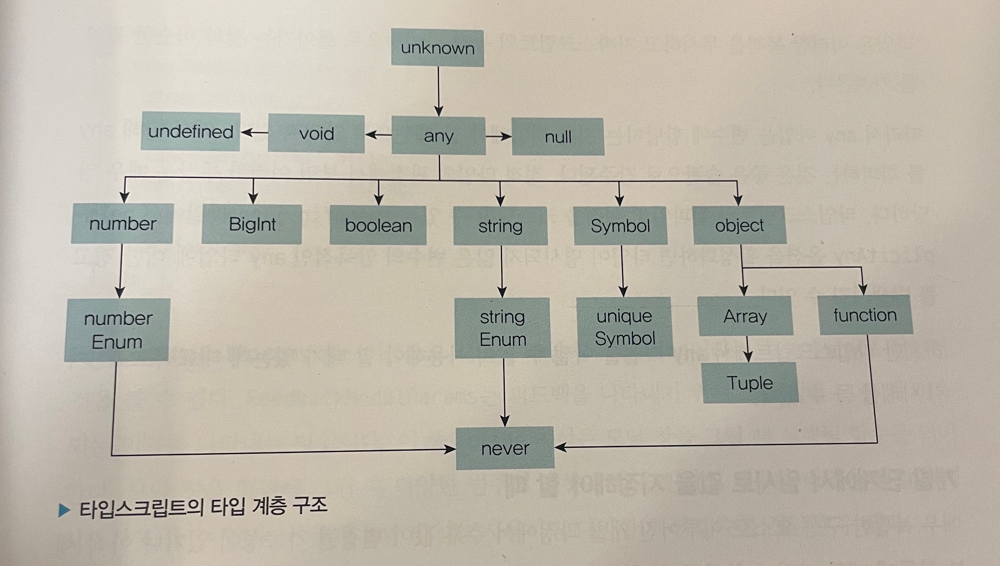

## 3.1 타입스크립트만의 독자적 타입 시스템

- 타입스크립트의 타입 시스템이 내포하고 있는 개념은 모두 자바스크립트에서 기인한 것.
- 자바스크립트의 슈퍼셋으로 정적 타이핑이 가능한 타입스크립트의 등장으로 비로소 타입 시스템이 구축됨
- ex: any -> ts에서만 존재하는 독자적인 타입 시스템
   - 타입스크립트의 타입 계층 구조

  ### any 타입

  - 자바스크립트에 존재하는 모든 값을 오류없이 받을 수 있음
  - 타입을 명시하지 않은 것과 동일한 효과
  - any는 ts의 근본적인 목적인 정적 타이핑에 위배되기에 사용이 지양됨
  - any를 어쩔 수 없이 사용하는 3가지 예시
    - 개발 단계에서 임시로 값을 지정해야 할 때: 개발 단계에서 추후 값이 변경될 가능성이 있거나 아직 세부 항목에 대한 타입이 확정되지 않은 경우
    - 어떤 값을 받아올지 또는 넘겨줄지 정할 수 없을 때: api 요청 및 응답 처리, 콜백 함수 전달, 타입이 잘 정제되지 않아 파악이 힘든 외부 라이브러리 등을 사용할 때
    - 값을 예측할 수 없을 때 암묵적으로 사용: 외부 라이브러리나 웹 api 요청에 따라 다양한 값을 반환하는 api에 대한 응답값 처리를 할 때
  - any를 지양해야 하는 이유: 타입스크립트의 타입 검사를 무색하게 만들고 잠재적 위험한 상황을 초래할 가능성이 커지기 때문

  ### unknown 타입

  - any 타입과 유사하게 모든 타입의 값이 할당될 수 있음
    | any | unknown |
    | ------------------------ | ---------------------------------------------------------- |
    | 어떤 타입이든 any 타입에 할당 가능 | 어떤 타입이든 unknown 타입에 할당 가능 |
    | any 타입은 never 제외 어떤 타입으로도 할당 가능 | unknown 타입은 any 타입 외에 다른 타입으로 할당 불가능 |

  - unknown 타입은 어떤 타입이 할당되었는지 알 수 없음을 나타내기에 unknown 타입으로 선언된 변수는 값을 가져오거나 내부 속성에 접근할 수 없다.
  - any 타입과 유사, 하지만 타입 검사를 강제하고 타입이 식별된 후에 사용할 수 있기 때문에 any 보다 안전하다.
  - 예상할 수 없는 데이터라면 unknown을 사용. 에러 핸들링할 때도 unknown 사용

  ### void 타입

  - 함수의 타입 지정에서 아무런 값을 반환하지 않는 경우에 void 타입 명시
  - js에서 명시적인 반환문을 작성하지 않으면 기본적으로 undefined가 반환됨
  - void !== undefined
  - 보통은 함수에 사용되는 타입이지만, 함수에 국한된 타입은 아님. 하지만 함수가 아닌 경우에 사용하는 것은 크게 의미 있지는 않음 -> 왜냐하면 값 타입 지정에는 이미 undefined와 null이 있기 때문
  - void 반환 타입을 명시하지 않아도, 만약 반환값이 없는 경우에 컴파일러가 알아서 void로 추론해줌

  ### never 타입

  - 일반적으로 함수와 관련하여 많이 사용되는 타입
  - 값을 반환할 수 없는 타입을 의미
  - 값을 반환하지 않는 것(void) vs 값을 반환할 수 없는 것(never)는 명확히 구분해야함
    - throw를 사용하여 에러를 던지는 경우 이는 값을 반환하는 것으로 간주하지 않음
      ```typescript
      function generateError(res: Response): never {
        throw new Error(res.getMessage());
      }
      ```
    - 함수 내에서 무한 루프를 실행하는 경우(결국 함수가 종료되지 않았다는 뜻이기에 값을 반환하지 못함)
      ```typescript
      function checkStatus(): never {
        while (true) {
          // ...
        }
      }
      ```
  - never 타입은 모든 타입의 하위 타입
  - never 타입은 자신을 제외한 어떤 타입도 never 타입에 할당될 수 없음.(any 타입도 never 타입에 할당할 수 없음)

  ### Array 타입

  - 배열 타입을 가리키는 Array 키워드
  - js에서의 Object.prototype.toString.call(...)는 typeof와 다르게 단순히 객체의 타입을 알려주는 것이 아닌 객체의 인스턴스까지 알려준다.
    ```typescript
    const arr = [];
    console.log(Object.prototype.toString.call(arr)); // [Object Array]
    ```
  - js에서도 있는 Array를 굳이 ts에서 다시 언급하는 이유?

    - js에서의 Array는 객체에 속하는 타입으로 분류. 즉, js에서의 배열은 단독으로 "배열"이라는 자료형으로 국한하지 않음
    - js에서의 한 배열 안에 원소는 어떤 값이든 삽입하고 관리가 가능(이는 정적 타이핑의 원리에 부합하지 않는다!!!)

      ```
      // javascript
      // 아래와 같이 다양한 형태의 원소를 가질 수 있음
      const aaa = [1, 2, "string", true];

      // JAVA
      // 배열의 원소는 한 가지 타입 밖에 가질 수 없음
      int array[3] = { 10, 20, 30};
      ```

    - 보통의 정적 타입의 언어에서는 배열을 선언할 때, 크기와 타입까지 동시에 제한한다.(js에서는 크기와 타입, 둘 다 제한하지 않음)
    - ts에서는 일반적으로 배열의 크기를 제한하지는 않지만, 명시적인 타입을 선언하여 타입은 제한함
    - 만약 js처럼 ts에서도 배열 안에 원소들을 다양하게 넣고 싶다면 유니온 타입을 사용하면 됨.
      ```typescript
      const array1: Array<number | string> = [1, "string"];
      const array2: number[] | string[] = [1, "string"];
      const array3: (number | string)[] = [1, "string"];
      ```
    - 스프레드 연산자(...)를 사용하여 특정 인덱스에는 요소를 명확한 타입으로 선언하고 나머지 인덱스에는 배열처럼 동일한 자료형의 원소를 개수 제한 없이 받도록 할 수도 있음
      ```typescript
      // 첫 번째 자리에는 숫자, 두 번째 자리에는 문자열을 받고, 그 이후로는 문자열 타입의 원소를 갯수 제한 없이 받을 수 있음
      const httpStatusFromPaths: [number, string, ...string[]] = [
        400,
        "Bad Request",
        "/users/:id",
        "/users/:userId",
        "/users/:uuid",
      ];
      ```

  ### enum 타입

  - 일종의 구조체를 만드는 타입 시스템
    ```typescript
    enum ProgrammingLanguage {
      Typescript = "Typescript",
      JavaScript = "Javascript",
      Java = 300,
      Python = 400,
      Kotlin, // 401
      Rust, // 402
      Go, // 403
    }
    ```
  - 각 멤버에 명시적으로 값 할당 가능. 일일이 할당하지 않아도, 알아서 이전 멤버 기준으로 1씩 늘려가며 자동 할당 해줌
  - 해당 열거형이 가지는 모든 멤버를 값으로 받을 수 있어서 코드의 가독성을 높여줌
  - Enum을 썼을 때의 장점
    - 타입 안정성: enum 타입에 명시되지 않은 값은 인자로 받을 수 없기에 타입 안정성이 뛰어남
    - 명확한 의미 전달과 높은 응집력: 해당 enum이 어떤 타입을 다루려는 지 값과 목적이 명확함
    - 가독성: 응집도가 높기에 enum 타입이 말하고자 하는 바가 ㄷ명확함
  - 관련이 높은 멤버를 모아 문자열 상수처럼 사용하고자 할 때 유용함
  - const enum을 숫자 상수로 관리하는 경우, 선언한 값 이외의 값을 할당하거나 접근할 때, 이를 방지하지 못함. 따라서 문자열 상수 방식으로 선언하는 것을 지향

        ```typescript
        const enum Number {
          ONE = 1,
          TWO = 2,
        }
        const myNumber: Number = 100; // Number enum에서 100을 관리하고 있지 않지만 이는 에러를 발생시키지 않음

        const enum STRING_NUMBER {
          ONE = "ONE",
          TWO = "TWO",
        }
        const myString: STRING_NUMBER = "THREE"; // ERROR
        ```

    <br><br>

## 3.2 타입 조합

### 교차 타입(Intersection)

- 여러 가지 타입을 결합하여 하나의 단일 타입으로 만드는 것
- &로 표기. 결과물로 탄생한 단일 타입에는 type alias 붙일 수 있음
- 타입 C가 타입 A와 B의 교차타입(A & B)이라면 타입 C는 타입 A와 타입 B의 모든 멤버를 가지고 있는 타입이다.

  ```typescript
  type ProductItem = {
    id: number;
    name: string;
    type: string;
    price: number;
    imageUrl: string;
    quantity: number;
  };

  // ProductItemWithDiscount는 ProductItem의 모든 멤버와 discountAmount까지 멤버로 가지게 된다
  type ProductItemWithDiscount = ProductItem & { discountAmount: number };
  ```

### 유니온(Union) 타입

- 타입 A 또는 타입 B 중 하나가 될 수 있는 타입. A | B로 표기

  ```typescript
  type CardItem = {
    id: number;
    name: string;
    type: string;
    imageUrl: string;
  };

  type PromotionEventItem = ProductItem | CardItem;

  const printPromotionItem = (item: PromotionEventItem) => {
    console.log(item.name); // 0
    console.log(item.quantity); // 컴파일 에러 발생!
  };
  ```

- 위 예시에서 item.quantity에 접근하려고 하면 컴파일 에러가 발생한다. 그 이유는?
- **PromotionEventItem은 ProductItem이 될 수도 있고, CardItem이 될 수도 있기 때문에, 즉 어느 타입이 될 지 모르기 때문에 ProductItem와 CardItem이 공통적으로 가지고 있는 멤버**를 가져야 한다. 그런데 quantity는 ProductItem에만 있는 멤버이기 때문에 이를 참조할 수 없어서 컴파일 에러가 난다.

### 인덱스 시그니처(Index Signatures)

- 특정 **타입의 속성 이름은 알 수 없지만 속성값의 타입을 알고 있을 때 사용**하는 문법
- 인터페이스 내부에 [Key: K]: T 꼴로 명시
- 해당 타입의 속성 키는 모두 K 타입이어야하고 속성값은 모두 T 타입을 가져아한다는 의미
  ```typescript
  interface IndexSignatureEx {
    [key: string]: number;
  }
  ```
- 다른 속성을 추가로 명시해줄 수 있는데, 이 대 추가로 명시된 속성은 인덱스 시그니처에 포함되는 타입이어야 함.
  ```typescript
  interface IndexSignature2 {
    [key: string]: [number | boolean];
    length: number; // OK
    isValid: boolean; // OK
    name: string; // 에러 발생
  }
  ```

### 인덱스드 엑세스 타입(Indexed Access Type)

- 다른 타입의 특정 속성이 가지는 타입을 조회하기 위해 사용

  ```typescript
  type Example {
    a: number;
    b: string;
    c: boolean;
  }

  type IndexedAccess = Example["a"];
  type IndexedAccess2 = Example["a" | "b"]; // number | string;
  type IndexedAccess3 = Example[keyof Example]; // number | string | boolean;
  ```

- 배열의 요소 타입을 조회하기 위해 사용하는 경우도 있음

### 맵드 타입(Mapped Type)

- 유사한 형태를 가진 여러 항목의 목록 A를 변환된 항목의 목록 B로 바꾸는 것을 의미
- 다른 타입을 기반으로 어떤 한 타입을 선언할 때 사용하는 문법

  ```typescript
  type Example {
    a: number;
    b: string;
    c: boolean;
  }

  type Subset<T> {
    [K in keyof T]?: T[K];
  }

  const aExample: Subset<Example> = {a: 3};
  const bExample: Subset<Example> = {b: "Hi"};
  const cExample: Subset<Example> = {a: 4, c: true};
  ```

### 템플릿 리터럴 타입(Template Literal Types)

- js의 템플릿 리터럴 문자열(백틱,`${}`)을 사용하여 문자열 리터럴 타입을 선언할 수 있는 문법
  ```typescript
  // 새로운 문자열 리터럴 유니온 타입의 생성
  type Stage = "init" | "select-image" | "edit-image";
  type StageName = `${State}-stage`;
  // 'init-stage', 'select-image-stage', 'edit-image-stage'
  ```

### 제네릭(Generic)

- C 혹은 JAVA등의 정적 언어에서 다양한 타입 간에 재사용성을 높이기 위해 사용하는 문법
- 제네릭의 사전적 의미: 특징이 없거나 일반적인 것
- ts에서의 제네릭: 일반화된 데이터 타입. 함수, 타입, 클래스 등에서 내부적으로 사용할 타입을 미리 정해두지 않고 타입 변수를 사용해서 해당 위치를 비워둔 다음, 실제로 그 값을 사용할 때 외부에서 타입 변수 자리에 타입을 지정하여 사용하는 방식
- 함수, 타입, 클래스 등 여러 타입에 대해 하나하나 따로 정의하지 않아도 되기 때문에 재사용성이 크게 향상됨
- <T>와 같이 꺾쇠괄호 내부에 정의됨
- 보통 T(Type), E(Element), K(Key), V(Value)등이 사용

  ```typescript
  type ExampleArrayType<T> = T[];

  const array1: ExampleArrayType<String> = ["치킨", "피자", "우동"];
  ```

- 배열을 any 타입으로 선언한 것과의 차이점: any[] -> 이거는 배열 안에 요소들이 다양한 타입을 가질 수 있지만 T[] -> 이거는 배열 안에 요소들의 타입이 전부 동일한 타입임을 보장
  ```typescript
  type ExampleArrayType2 = any[];
  // 제네릭 <T>와 달리 any 타입으로 정의한 배열은 배열 안에 요소들의 타입이 다 다를 수 있다.
  const array2: ExampleArrayType2 = [
    "치킨",
    {
      id: 0,
      name: "햄버거",
    },
    99,
    true,
  ];
  ```
- 반드시 꺾쇠괄호(<>) 안에 타입을 명시해야 하는 것은 아님
- 타입을 명시하는 부분을 생략하면 컴파일러가 인수를 보고 타입을 추론해줌
- 제네릭은 일반화된 데이터 타입을 의미하기에 특정한 타입에서만 존재하는 멤버를 참조하려고 하면 안됨. ex) 배열에서만 존재하는 length 속성을 제네릭에서 참조하려고 하면 에러남
- 하지만 제약을 걸어주면 특정 속성을 참조 가능

  ```typescript
  function exampleFunc2<T>(arg: T): number {
    return arg.length; // 에러 발생: type T에 length라는 속성이 없습니다
  }

  interface TypeWithLength {
    length;
    number;
  }

  function exampleFunc2<T extends TypeWithLength>(arg: T): number {
    return arg.length; // length라는 속성을 가진 타입만 받는다는 제약을 걸어줬음으로 실행 가능
  }
  ```

- jsx에서는 꺾쇠괄호(<>)를 태그로 인식하는 경우가 있기 때문에 화살표 함수에서는 꺾쇠괄호만 사용하지말고 제네릭 부분에 extends 키워드를 추가하여 컴파일러에게 특정 타입의 하위 타입만 올 수 있음을 확실히 알려주면 된다.

  ```typescript
  // js에서는 <T> 부분에서 에러 발생: "JSX element 'T' has no corresponding closing tag" -> <T>를 html 태그로 인식해서 닫힌 태그가 없다라는 오류
  const arrowExampleFunc = <T>(arg: T): T[] => {
    return new Array(3).fill(arg);
  };

  // extends 키워드를 이용한 해결 방법. 에러 발생 X
  const arrowExampleFunc2 = <T extends TypeWithLength>(arg: T): T => {
    return new Array(3).fill(arg);
  };
  ```

  <br><br>

## 3.3 제네릭 사용법

### 함수의 제네릭

- 함수의 매개변수나 반환 값에 다양한 타입을 넣고 싶을 때, 제네릭을 사용할 수 있다.

### 호출 시그니처의 제네릭

- 타입스크립트의 함수 타입 문법으로 함수의 매개변수와 반환 타입을 미리 선언하는 것을 의미
- 제네릭 타입을 어디에 위치시키는지에 따라 타입의 범위와 제네릭 타입을 언제 구체 타입으로 한정할 지 결정할 수 있음

```typescript
interface useSelectPaginationProps<T> {
  categoryAtom: RecoilState<number>;
  filterAtom:: Recoil State<string[]>; sortAtom;
  RecoilState<SortType>;
  fetcherFunc: (props: CommonListRequest) => Promise<DefaultResponse<ContentListResponse<T>>>;
}
```

### 제네릭 클래스

- 제네릭 클래스는 외부에서 입력된 타입을 클래스 내부에 적용할 수 있는 클래스.

```typescript
class LocalDB<T> {
  async put(table: string, row: T): Promise<T> {
    return new Promise<T>((resolve, reject) => {
      // T 타입의 데이터를 DB에 저장
    });
  }
  async get(table: string, key: any): Promise<T> {
    return new Promise<T>((resolve, reject) => {
      // T 타입의 데이터를 DB에서 가져옴
    });
  }
}

export default class IndexedDB implements ICacheStore {
  private _DB?: LocalDB<{
    key: string;
    value: Promise<Record<string, unknown>>;
    cacheTTL: number;
  }>;

  private DB() {
    if (!this._DB) {
      this._DB = new LocalDB("localCache", {
        ver: 6,
        tables: [{ name: TABLE_NAME, keyPath: "key" }],
      });
    }
    return this._DB;
  }
}
```

- 클래스 이름 뒤에 타입 매개변수인 <T>를 선언하고, localDB 클래스는 외부에서 {key: ~~} 타입을 받아들여 클래스 내부에서 사용될 제네릭 타입으로 결정됨

### 제한된 제네릭

- 타입 매개변수에 대한 제약 조건을 설정하는 기능
- ex: string 타입으로 제약. 타입 매개변수는 특정 타입을 상속해야함
  ```typescript
  type ErrorRecord<Key extends string> = Exclude<
    Key,
    ErrorCodeType
  > extends never
    ? Partial<Record<Key, boolean>>
    : never;
  // 이 코드에서 string으로 묶인 Key를 바운드 타입 매개변수(bounded type parameters)라고 부르고, string을 키의 상한 한계(upper bound)라고 한다.
  // 상속 받을 수 있는 타입은 기본 타입 뿐만 아니라 상황에 따라 인터페이스나 클래스도 가능
  ```

### 확장된 제네릭

- 제네릭 타입은 여러 타입을 상속 받을 수 있으며 타입 매개변수를 여러 개 둘 수도 있음
  ```typescript
  <Key extends string | number>
  ```

### 제네릭 예시

- 제네릭의 장점: 다양한 타입을 받게 함으로써 코드를 효율적으로 재사용 할 수 있음.
- 현업에서는 API 응답 값의 타입을 지정할 때 제네릭을 가장 자주 활용

  ```typescript
  export interface MobileApiResponse<Data> {
    data: Data;
    statusCode: string;
    statusMessage: string;
  }

  // 실제 API 응답 값의 타입 지정 예시
  export const fetchPriceInfo = (): Promise<MobileApiRsponse<PriceInfo>> => {
    const priceUrl = "https://~~";

    return request({
      method: "GET",
      url: priceUrl,
    });
  };
  ```

### 제네릭을 굳이 사용하지 않아도 되는 타입

```typescript
// 아래 코드는 불필요한 제네릭을 선언한 것. GType의 목적도 불분명하고, 굳이 제네릭을 사용하지 않고 타입 매개변수를 그대로 선언한 것과 같은 기능
type GType<T> = T;
type RequirementType = "USE" | "UN_USE" | "NON_SELECT";
interface Order {
  getRequirements(): GType<RequirementType>;
}

// 위 코드와 같은 기능을 하는 코드(불필요한 제네릭 제외)
type RequirementType = "USE" | "UN_USE" | "NON_SELECT";
interface Order {
  getRequirements(): RequirementType;
}
```

- 제네릭으로 any를 사용할 경우, any 타입은 모든 타입을 허용하기 때문에 사실상 ts를 쓰는 의미가 없어짐
