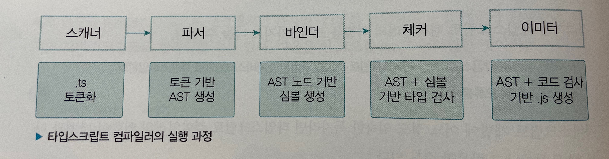
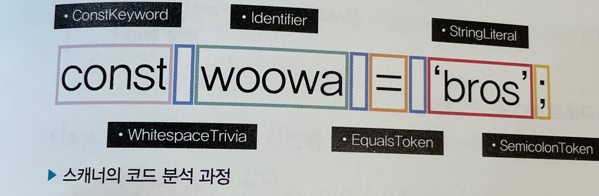
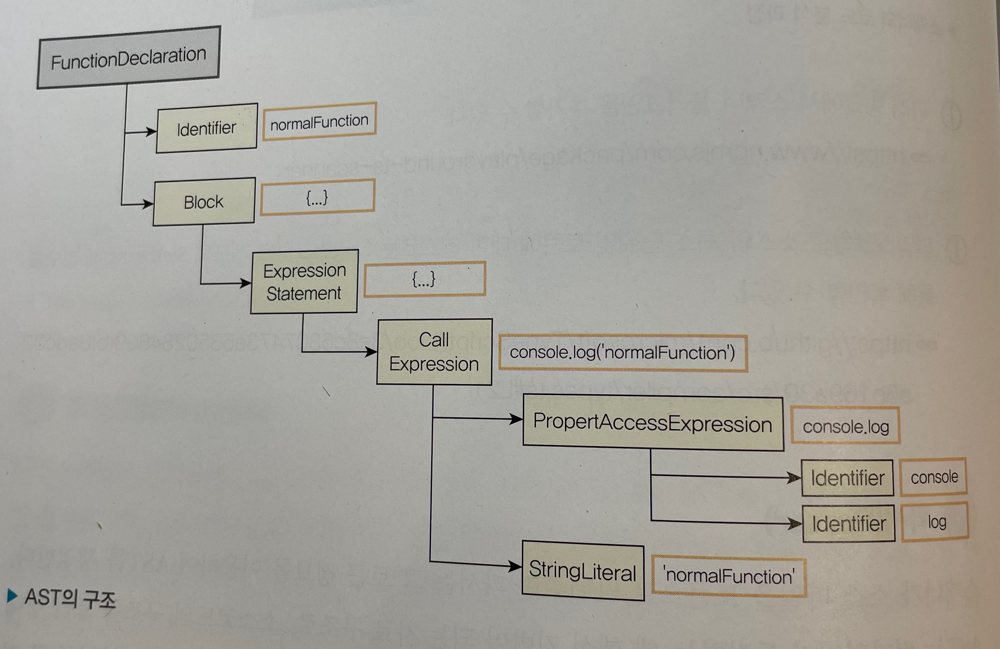

## 6.1 자바스크립트의 런타임과 타입스크립트의 컴파일

### 런타임과 컴파일타임

- 프로그래밍 언어의 고수준 언어: 사람이 이해하기 쉬운 형식
- 저수준 언어: 컴퓨터가 이해하기 쉬운 형식
- 자바스크립트는 대표적인 고수준 언어. 따라서 컴파일러나 인터프리터에 의해 저수준 언어로 번역되어 실행된.
- 소스코드는 컴파일러에 의해 기계어로 코드가 변환되어 실행이 가능한 프로그램이 되는데, 이 단계가 **컴파일 타임**.
- 컴파일타임: 소스코드가 컴파일 과정을 거쳐 컴퓨터가 인식할 수 있는 기계어(바이트 코드)로 변환되어 실행할 수 있는 프로그램이 되는 과정
- 컴파일이 완료되면 프로그램이 메모리에 적재되어 실행되는데, 이를 런타임(runtime)이라고 한다.

### 자바스크립트의 런타임

- 자바스크립트의 런타임: 프로그램이 실행되는 환경을 의미
- ex: 구글 브라우저, Node.js등
- 자바스크립트는 인터프리터 언어로 별도의 컴파일 과정이 없다고 알려져 있는데, 엄밀히 말하면, 자바스크립트도 V8 엔진을 통하여 자바스크립트 코드를 최적화 하기 위해 컴파일 단계를 거친다.

### 타입스크립트의 컴파일

- 일반적인 컴파일: 고수준 언어에서 저수준 언어로 변환되는 과정.
- 타입스크립트는 tsc라고 불리는 컴파일러를 통해 자바스크립트 코드로 변환됨
- 하지만 이는 고수준 언어 -> 저수준 언어가 아닌 고수준 언어(ts) -> 고수준 언어(js)로 변환되는 것이기에 컴파일이 아닌 트랜스파일이라고도 불림
- 타입스크립트 컴파일러를 소스 대 소스 컴파일러(source-to-source compiler)라고도 불림
- c.f) 트랜스파일의 또 다른 예시. ES6 버전 이상의 문법을 ES5 버전 이하의 문법으로 변환해주는 바벨(Babel)
- 타입스크립트 컴파일러는 소스코드를 해석하여 AST(Abstract Syntax Tree: 최소 구문 트리)를 만드ㅡㄹ고, 이후 타입 확인을 거친 다음에 결과 코드를 생성

### 타입스크립트가 소스코드를 컴파일하여 프로그램이 실행되기까지의 과정

- c.f) AST(Abstract Syntax Tree): 컴파일러가 소스코드를 해석하는 과정에서 생성하는 데이터 구조. **어휘적 분석**과 **구문 분석**을 통해 소스코드를 노드 단위의 트리 구조로 구성한다.
- 1. 타입스크립트 소스코드를 타입스크립트 AST로 만든다(tsc)
- 2. 타입 검사기가 AST를 확인하여 타입을 확인(tsc)
- 3. 타입스크립트 AST를 자바스크립트 소스로 변환(tsc)
- 4. 자바스크립트 소스코드를 자바스크립트 AST로 만든다.(런타임)
- 5. AST가 바이트 코드로 변환된다.(런타임)
- 6. 런타임에서 바이트 코드가 평가되어 프로그램이 실행된다.(런타임)

- 이 때 tsc는 타입 정보를 1,2 에서만 확인한다. 3단계부터는 타입을 확인하지 않음
- 즉, 개발자가 작성한 타입 정보는 단지 타입 확인하는 용도로 밖에 안쓰이고, 최종적으로 만들어지는 프로그램에는 아무런 영향 안끼침
- ts는 컴파일타임에 타입 이상 시에 프로그램을 실행시키지 않기에 정적 타입 검사기라고 부른다.
  <br><br>

## 6.2 타입스크립트 컴파일러의 동작

- 타입스크립트 컴파일러는 ts 소스 -> js 소스로 변환되는 모든 과정에 영향을 줌

### 코드 검사기로서의 타입스크립트 컴파일러

- ts 컴파일러는 컴파일 단계에서 타입의 오류를 살펴보기 때문에 타입 오류가 있으면 코드를 실행시켜주는 것 자체를 안함
- 컴파일타임에 문법 오류, 타입 관련 오류를 모두 찾아냄
- 타입 검사를 거쳐 코드를 안전하게 만든 이후, 타입스크립트 AST를 자바스크립트 코드로 변환

### 코드 변환기로서의 타입스크립트 컴파일러

- ts 컴파일러는 타입 검사 이후, 런타임에서 동작할 수 있도록 ts 파일을 js 파일로 트랜스파일 해줌

  ```typescript
  // js 코드로 트랜스파일 되기 전 ts 코드
  type Fruit = "banana" | "watermelon" | "orange" | "apple";
  const fruitBox: Fruit[] = ["banana", "apple", "orange"];

  const welcome = (name: string) => {
    console.log(`hi!${name}`);
  };

  // js 코드로 트랜스파일이 완료된 js 코드
  // 타입이 다 제거된 모습
  ("use strict");
  var fruitBox = ["banana", "apple", "orange"];
  var welcome = function (name) {
    console.log("hi!".concat(name, " :)"));
  };
  ```

- ts가 js로 컴파일 되어야 비로서 브라우저가 이 코드를 이해하고 정상적으로 실행할 수 있음.
- tsc와 babel의 공통점과 차이점
  - 공통점: 소스코드를 ES5 이하의 자바스크립트 코드로 컴파일 해 줌
  - 차이점: 바벨은 tsc와 달리 타입 검사를 하지 않는다.
    <br><br>

## 6.3 타입스크립트 컴파일러의 구조

- 컴파일러는 하나의 프로그램. 따라서 컴파일러를 구현한 소스 파일이 존재.
   - 컴파일러의 구조

- 프로그램

  - tsc는 tsc 명령어로 실행됨
  - tsconfig.json에 명시된 옵션을 기반으로 컴파일 수행
  - 먼제 전체적인 컴파일 과정을 관리하는 프로그램 객체(instance) 생성
  - 이 프로그램 객체는 컴파일할 ts 소스 파일과 소스 파일 내에서 임포트된 파일을 불러옴
  - 가장 최초로 불러온 파일을 기준으로 컴파일 시작

- 스캐너(Scanner)

  - ts 소스 파일을 어휘적으로 분석(lexical analysis)하여 토큰 생성.
  - 소스코드를 작은 단위로 나누어 의미 있는 토큰으로 변환하는 작업
     - 스캐너가 소스코드를 작은 단위의 토큰으로 분해, 분석하는 과정

- 파서(Parser)

  - 파서는 분해된 토큰 정보를 이용하여 AST 생성
  - AST는 컴파일러가 동작하는 데 핵심 기반이 되는 자료구조.
  - 소스코드의 구조를 트리 형태로 표현
  - AST의 최상위 노드는 타입스크립트 소스파일
  - AST의 최하위 노드는 파일의 끝 지점으로 구성
  - 토큰을 사용하여 구문적 분석(Syntax analysis) 수행하여 코드의 실질적인 구조를 노드 단위의 트리 형태로 표현
    ```typescript
    function normalFunction() {
      console.log("normal function");
    }
    normalFunction();
    ```
     - 위 코드를 토큰화 한 후, 파서가 AST를 생성했을 때의 구조

- 바인더(Binder)

  - 바인더의 주요 역할은 체커 단계에서 타입 검사를 할 수 있도록 기반을 마련하는 것.
  - 바인더는 타입 검사를 위해 심볼(Symbol)이라는 데이터 구조를 생성
  - 바인더는 심볼을 생성하고 해당 심볼과 그에 대응하는 AST 노드를 연결하는 역할

- 체커(Checker)와 이미터(Emitter)
  - 체커는 AST와 심볼을 활용하여 타입 검사를 수행
  - 체커의 소스 크기는 파서의 소스 크기보다 매우 큼. 즉, 타입 검사가 차지하는 비중이 크다는 것을 암시
  - 체커의 주요 역할: AST의 노드를 탐색하면서 심볼 정보를 불러와 주어진 소스 파일에 대해 타입 검사를 진행.
  - **이미터는 ts 소스코드를 자바스크립트 파일과 타입 선언 파일로 생성**한다!!!
  - 이미터는 체커를 통해 코드에 대한 타입 검증 정보를 가져옴
  - emitter.ts의 emitFiles() 함수를 사용하여 ts 코드의 변환을 진행한다.
