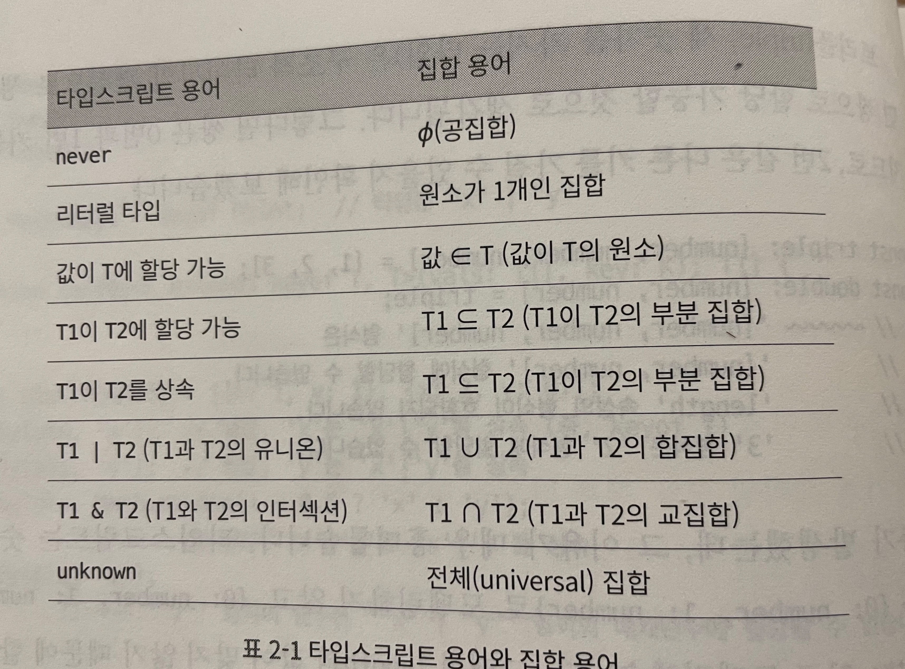

## 2장. 타입스크립트의 타입 시스템

### 아이템 6: 편집기를 사용하여 타입 시스템 탐색하기

- 타입스크립트의 두가지 주된 기능

  - 타입스크립트 컴파일러(tsc)
  - 단독으로 실행할 수 있는 타입스크립트 서버(tsserver)

- 타입스크립트를 사용하면 타입의 추론, 자동 완성과 같은 기능들을 사용할 수 있어서 개발에 유용함
- 타입스크립트가 동작을 어떻게 모델링하는지 아릭 위해 d.ts 선언 파일을 찾아보는 방법도 알아야 함

### 아이템 7: 타입이 값들의 집합이라고 생각하기

- 타입: 할당 가능한 값들의 집합, 집합: 타입의 범위
- never: 공집합
- type A = 'A'; 와 같이 한 가지 값만 포함하는 타입 -> 유닛 타입이라고 불리는 리터럴 타입

  ```typescript
  interface Person {
    name: string;
  }
  interface Liespan {
    birth: Date;
    death?: Date;
  }
  type PersonSpan = Person & Lifespan;

  const ps: PersonSpan = {
    name: "John",
    birth: new Date("1920/03/02"),
    death: new Date("1980/04/22"),
  }; // 정상

  type K = keyof (Person | Lifespan); // never
  ```

- & 연산자는 교집합을 의미하기에 언뜻 봤을 때, Person과 Lifespan의 교집합이 없는 것처럼 보이지만(never), 사실 타입 연산자는 인터페이스의 "속성이 아닌", "값의 집합(타입의 범위)"에 적용됨.
- 따라서 Person과 Lifespan을 둘 다 가지는 값은 인터섹션 타입에 속하게 됨
- 인터섹션 타입은 **각 타입 내의 속성을 모두 포함하는 것이 일반적인 규칙**
  ```typescript
  keyof (A&B) = (keyof A) | (keyof B)
  keyof (A|B) = (keyof A) & (keyof B)
  ```
- 타입을 확장하려면 extends 키워드를 통한 상속이 일반적
  ```typescript
  interface Person {
    name: string;
  }
  // PersonSpan은 name 속성을 가져야 함
  interface PersonSpan extends Person {
    birth: Date;
    death?: Date;
  }
  ```
   - 타입스크립트의 집합 관계

### 아이템 8: 타입 공간과 값 공간의 심벌 구분하기

- 같은 이름으로 타입과 값이 동시에 쓰이고 있다면 오류가 발생할 수 있음

  ```typescript
  // Cylinder라는 이름의 심벌이 타입과 값 둘 다 사용되고 있음
  interface Cylinder {
    radius: number;
    height: number;
  }
  const Cylinder = (radius: number, height: number) => ({ radius, height });

  function calculateVolume(shape: unknown) {
    if (shape instanceof Cylinder) {
      shpae.radius;
      // '{}' 형식에 'radius' 속성이 없습니다.
    }
  }
  ```

- instanceof는 값에 대한 연산을 하는 자바스크립트 런타임 연산자. 따라서 타입이 아니라 값을 참조(const Cylinder 부분).
- 그래서 에러 발생
- 따아서 한 심벌이 타입인지 값인지는 언뜻봐서는 알 수 없음
- 보통 type이나 interface 다음에 나오는 심벌은 "타입"
- const나 let 뒤에 쓰이는 것은 "값"
- 타입선언(:) 혹은 단언문(as) 뒤에 나오는 심벌은 "타입"
- 등호(=) 뒤에 나오는 심벌은 "값"
  ```typescript
  // 타입의 관점에서 typeof는 값을 읽어서 타입스크립트 타입을 반환한다.
  type T1 = typeof p; // Person "타입"
  // 값의 관점에서 typeof는 자바스크립트 런타임의 typeof 연산자가 되어 object 문자열을 반환한다
  const v1 = typeof p; // object "값"
  ```
- class나 enum은 타입과 값, 두 가지 모두로 사용될 수 있음

### 아이템 9: 타입 단언보다는 타입 선언을 사용하기

```typescript
interface Person {
  name: string;
}
const alice: Person = { name: "Alice" }; // 타입은 Person
const bob = { name: "Bob" } as Person; // 타입은 Person
```

- alice는 변수에 '타입 선언'을 붙여서 그 값이 선언된 타입임을 명시
- bob은 as Person으로 '타입 단언' 수행. 타입 단언을 하면 타입스크립트가 추론한 타입이 있더라도 Person 타입으로 간주한다.
- 타입 단언보다는 타입 선언을 사용하는 것이 나음. why?
  ```typescript
  const alice: Person = {}; // 'Person 유형에 필요한 'name' 속성이 '{}' 유형에 없습니다.
  const bob = {} as Person;
  ```
- 타입 선언은 할당되는 값이 해당 인터페이스를 만족하는지 검사함. alice는 {} 값이 Person 인터페이스 속성을 만족시키지 못했기에 오류 발생
- 타입 단언은 강제로 타입을 지정하였기 때문에 타입 체커에게 오류를 무시하라고 하는 것
- 이는 interface에 없는 속성을 추가하려고 할 때에도 동일하게 적용됨
- 따라서 타입 단언이 꼭 필요한 경우가 아니라면, 안전성 체크도 되는 "타입 선언"을 사용하는 것이 좋음

- 타입 단언은 타입체커가 체크한 타입보다 개발자가 판단하는 타입이 더 정확할 때 의미가 있음
  ```typescript
  document.querySelector("#myButton").addEventListener("click", (e) => {
    e.currentTarget;
    // 개발자는 myButton에 해당하는 element가 button element라는 것을 알고 있기 때문에(타입체커는 DOM에 접근할 수 없어서 mybutton에 대한 타입을 모르는 반면)
    // 따라서 이런 경우에는 as를 이용한 타입 단언이 더 유용할 수 있다.
    const button = e.currentTarget as HTMLButtonElement;
  });
  ```
- 접두사로 쓰이는 !는 부정문. 접미사로 쓰이는 !는 그 값이 null이 아니라는 단언문
  ```typescript
  let x: string | null = //...
  // 컴파일러에게 x가 null이 아니라고 단언
  let y: string = x!;
  ```
- 실제로 변수가 null이 아니라는 확신이 있을 때, 사용해야 하며, 만약 그렇지 않은 경우, 런타임 에러가 발생한다.

### 아이템 10: 객체 래퍼 타입 피하기

```typescript
"hello" === new String("hello"); // false
// String 객체 래퍼는 오직 자기 자신하고만 동일
new String("hello") === new String("hello"); // false
```

- ts에서는 객체 래퍼 타입을 지양하고, 대신 기본형 타입을 사용해야 한다.
- String 대신 string, Number 대신 number, Boolean 대신 boolean, Symbol 대신 symbol을 사용해야 함.

### 아이템 11: 잉여 속성 체크의 한계 인지하기

- 객체 리터럴을 변수에 할당하거나 함수에 매개변수로 전달할 때 잉여 속성 체크가 수행됨

```typescript
interface Room {
  numDoors: number;
  ceilingHeightFt: number;
}
const r: Room = {
  numDoors: 1,
  ceilingHeightFt: 10,
  elephant: "present",
  // 에러 발생. 객체 리터럴은 알려진 속성만 지정할 수 있으며 'Room' 형식에 'elephant'가 없습니다.
};

const obj = {
  numDoors: 1,
  ceilingHeightFt: 10,
  elephant: "present",
};
const r: Room = obj; // 에러 안남
```

- 첫번째 예시: '잉여 속성 체크'라는 과정이 수행된 것. 잉여 속성 체크는 기본적으로 타입 시스템의 구조적 본질을 해치지 않으면서도 "객체 리터럴"에 알 수 없는 속성을 허용하지 않음.
  따라서, elephant 속성에 에러가 난 것.
- 두번째 예시: 객체 리터럴이 아님. 따라서 잉여 속성 체크가 적용되지 않음. 이는 as를 사용한 타입 단언문을 사용할 때에도 적용되지 않음. 따라서 단언문 보다는 선언문을 사용해야 함.
- 임시변수를 도입하면 잉여 속성 체크를 건너뛸 수 있음.

### 아이템 12: 함수 표현식에 타입 적용하기

- js, ts에서는 함수 문장(statement)과 함수 표현식(expression)을 다르게 인식한다.
  ```typescript
  function rollDice1(sides: number): number {/** */} // 문장
  const rollDice2 = function(sides: number): number {/** */} // 표현식
  const rollDice3 = (sides: number): number {/** */} // 표현식
  ```
- ts에서는 함수 *표현식*을 사용하는 것이 좋음. 왜냐하면 매개변수부터 반환값까지 전체를 함수 타입으로 선언하여 함수 표현식에 재사용할 수 있기 때문

- 함수 표현식에 타입을 선언한다면 아래 예시와 같이 불필요한 코드의 반복을 줄일 수 있음

  ```typescript
  // 함수 문장으로 하면 계속 타입을 지정해줘야하는 번거로움이 있음
  function add(a: number, b: number) {
    return a + b;
  }
  function sub(a: number, b: number) {
    return a - b;
  }
  function mul(a: number, b: number) {
    return a * b;
  }
  function div(a: number, b: number) {
    return a / b;
  }

  // 함수 표현식에서의 타입 지정으로 코드 중복을 줄일 수 있음
  // 구현부와 선언부가 분리되어 있어 로직이 분명해지는 장점
  type BinaryFn = (a: number, b: number) => number;
  const add: BinaryFn = (a, b) => a + b;
  const sub: BinaryFn = (a, b) => a - b;
  const mul: BinaryFn = (a, b) => a * b;
  const div: BinaryFn = (a, b) => a / b;
  ```

- 따라서 매개변수나 반환 값에 타입을 명시하기 보다는 함수 표현식 전체에 타입을 적용하는 것이 좋음

### 아이템 13: 타입과 인터페이스의 차이점 알기

- ts에서의 명명된 타입을 정의하는 두 가지 방법 -> type, interface

  ```typescript
  type TState = {
    name: string;
    capital: string;
  };

  interface IState {
    name: string;
    capital: string;
  }
  ```

- type, interface 둘 다, 타입 별칭 및 제네릭이 가능하다

  ```typescript
  type TFnWithProperties = {
    (x: number): number;
    prop: string;
  };

  interface IFnWithProperties {
    (x: number): number;
    prop: string;
  }

  type TPair<T> = {
    first: T;
    second: T;
  };

  interface IPair<T> {
    first: T;
    second: T;
  }
  ```

- 인터페이스는 타입을 확장할 수 있고, 타입은 인터페이스를 확장할 수 있다.
- 그리고 인터페이스는 유니온과 같은 복잡한 타입은 확장할 수 없음.
  ```typescript
  interface IStateWithPop extends TState {
    population: number;
  }
  type TStateWithPop = IState & { population: number };
  ```
- 타입과 인터페이스의 차이
- 유니온 타입은 있지만, 유니온 인터페이스는 없다 -> 즉, 인터페이스는 유니온 타입을 확장할 수 없다.
  ```typescript
  // 인터페이스는 아래와 같은 유니온 타입 확장을 할 수 없다
  // 일반적으로 인터페이스보다 타입이 더 범용적임
  type NamedVariable = (Input | Output) & { name: string };
  ```
- 인터페이스는 보강(augment)이 가능하다.
  ```typescript
  interface IState {
    name: string;
    capital: string;
  }
  interface IState {
    population: number;
  }
  // 인터페이스는 타입 보강을 통해 아래와 같은 케이스가 가능하다.
  // 이와 같이 속성을 확장하는 것을 선언 병합(declaration merging)이라고 함
  const wyoming: IState = {
    name: 'Wyoming',
    capital: 'Cheyenne';
    population: 500000;
  }
  ```
- 속성이 추가되는 것을 원치 않는다면 type을 사용하도록

- type과 interface는 각각 언제 사용하는지. 일관성과 보강의 측면에서 판단해야 함
  - type
    - 복잡한 타입일 경우
    - 일관된 type 코드베이스에서 type을 사용하고 있는 경우
  - interface
    - 일관된 interface 코드베이스에서 interface를 사용하고 있는 경우
    - 어떤 API에 대한 타입 선언을 작성해야 하는 경우(추후 새로운 필드와의 병합이 쉽기 때문)

### 아이템 14: 타입 연산과 제네릭 사용으로 반복 줄이기

- 타입에서의 중복 제거

  ```typescript
  interface Person {
    firstName: string;
    lastName: string;
  }

  interface PersonWithBirth {
    firstName: string;
    lastName: string;
    birth: Date;
  }

  // 위 코드를 DRY(Don't Repeat Yourself) 원칙을 적용시켜 다음과 같이 중복을 제거할 수 있다.

  interface PersonWithBirth extends Person {
    birth: Date;
  }
  // or

  type PersonWithBirth = Person & { birth: Date };
  ```

- 타입에서의 중복 제거 예시2

  ```typescript
  interface State {
    userId: string;
    pageTitle: string;
    recentFiles: string[];
    pageContents: string;
  }

  interface TopNavState {
    userId: string;
    pageTitle: string;
    recentFiles: string[];
  }

  // 위 예시를 아래와 같이 변환하여 중복을 줄일 수 있음
  type TopNavState = {
    userId: State["userId"];
    pageTitle: State["pageTitle"];
    recentFiles: State["recentFiles"];
  };

  // Mapped type을 사용하여 코드를 더 줄일 수 있음
  // 배열의 필드를 루프 도는 방식
  type TopNavState = {
    [k in "userId" | "pageTitle" | "recentFiles"]: State[k];
  };
  ```

- Pick

  ```typescript
  // Pick 제네릭 정의
  type Pick<T, K> = { [k in K]: T[K] };

  // Pick 제네릭 사용
  type TopNavState = Pick<State, "userId" | "pageTitle" | "recentFiles">;
  ```

  - 두 가지 타입을 받아서 결과 타입을 반환한다.

- Partial

  - 생성하고 난 후, 업데이트가 되는 클래스의 경우
  - update 메서드의 매개변수는 생성자와 동일한 매개변수이며, 타입 대부분이 선택적 필드가 됨

    ```typescript
    interface Options {
      width: number;
      height: number;
      color: string;
      label: string;
    }
    interface OptionsUpdate {
      width?: number;
      height?: number;
      color?: string;
      label?: string;
    }
    class UIWidget {
      constructor(options: Options) {
        /** */
      }
      update(options: OptionsUpdate) {
        /** */
      }
    }

    // keyof를 사용하여 Options로부터 OptionsUpdate를 만들 수 있음
    type OptionsUpdate = { [k in keyof Options]?: Options[k] };

    // 위와 똑같은 기능을 Parital 제네릭 타입으로 구현할 수 있음
    class UIWidget {
      constructor(init: Options) {
        /** */
      }
      update(options: Partial<Options>) {
        /** */
      }
    }
    ```

  - 매핑된 타입은 순회하며 Options 내 k 값에 해당하는 속성이 있는지 찾고, ?를 통해 속성을 선택적으로 만든다.

- 제네릭 타입 == 타입을 위한 함수. 즉, 타입 반복 대신 제네릭 타입을 사용하여 타입들 간에 매핑하는 것이 좋음

- 제네릭 타입에서 매개변수를 제한할 수 있는 방법: extends를 사용

### 아이템 15: 동적 데이터에 인덱스 시그니처 사용하기

- 타입스크립트에서는 타입에 '인덱스 시그니처'를 명시하여 유연하게 매핑을 표현할 수 있음
  ```typescript
  type Rocket = { [property: string]: string };
  const rocket: Rocket = {
    name: "Falcon",
    variant: "v1.0",
    thrust: "3940 kN",
  }; // 정상
  ```
- [property: string]: string이 _인덱스 시그니처_. 다음 세 가지 의미를 담고있음

  - 키의 이름: 키의 위치만 표시하는 용도. 타입 체커에서는 사용하지 않기 때문에 무시할 수 있는 참고 정보
  - 키의 타입: string이나 number 또는 symbol의 조합이어야 하지만, 보통은 string 사용
  - 값의 타입: 여떤 것이든 될 수 있음

- 위와 같이 코드를 짜면 4가지 단점이 드러남

  - 잘못된 키를 포함한 모든 키를 허용(name 대신 Name으로 작성해도 유효한 Rocket 타입이 됨)
  - 특정 키가 필요하지 않음. {}도 유호한 Rocket 타입
  - 키마다 다른 타입을 가질 수 없음. ex: thrust는 number의 타입을 가질 수 없음
  - 키를 입력할 때, 키는 어떤 값이든 될 수 있어서 자동 완성 기능이 동작하지 않음

- 따라서 Rocket은 인덱스 시그니처에 적합하지 않아서 interface로 작성해야함
- 예를 들어 CSV 파일처럼 헤더 행에 열 이름이 있고, 데이터 행을 열 이름과 값으로 매핑하는 객체를 나타내고 싶은 경우, 열 이름으로는 무엇이 올 지 미리 알 방법이 없으니 인덱스 시그니처를 사용하는 것이 바람직.

  ```typescript
  // 인덱스 시그니처를 이용하여 column의 key와 value를 유동적으로 할당한다.
  function parseCSV(input: string): { [columnName: string]: string }[] {
    const lines = input.split("\n");
    const [header, ...rows] = lines;
    const headerColumns = header.split(",");
    return rows.map((rowStr) => {
      const row: { [columnName: string]: string } = {};
      rowStr.split(",").forEach(); // blah blah
      return row;
    });
  }
  ```

- 안전한 접근을 위해 인덱스 시그니처의 값 타입에 undefined를 추가하는 것을 고려해야 함.
- 가능하다면 인덱스 시그니처보다 인터페이스, Record 제네릭, 매핑된 타입 같은 더 정확한 타입을 사용하는 것이 좋음

### 아이템 16: number 인덱스 시그니처보다는 Array, 튜플, ArrayLike를 사용하기

- 자바스크립트의 객체에서는 숫자 타입의 key를 허용하지 않음. 숫자를 키로 지정해도, 런타임 때 다 문자로 바뀜.

- ts에서는 숫자 키를 허용하고,문자열 키와 다른 것으로 인식.

- 인덱스 시그니처에 number를 사용하기보다 Array나 튜플, 또는 ArrayLike 타입을 사용하는 것이 좋음

### 아이템 17: 변경 관련된 오류 방지를 위해 readonly 사용하기

- readonly

  - 요소를 읽을 수 있지만, 쓸 수는 없음
  - 배열(객체)등을 읽을 수는 있지만, 바꿀 수는 없음
  - 배열을 변경하는 pop을 비롯한 다른 메서드를 호출할 수 없음

- number[]은 readonly number[]의 서브 타입.
- c.f) 서브타입: 부모 클래스를 상속 받은 자식 클래스에서, 자식 클래스는 기능이 더 많다. 이 때, 상속을 받은 자식 클래스를 부모 클래스의 서브 타입이라고 지칭한다.
- 따라서 number[]는 readonly number[]의 서브 타입이기 때문에 number[]의 기능이 더 많다.
- 즉, 변경 가능한 배열을 readonly 배열에는 할당할 수 있으나, readonly 배열을 변경 가능한 배열에 할당할 수는 없음. (Dog는 Animal이지만, Animal은 Dog가 아닌 개념)

  ```typescript
  const a: number[] = [1, 2, 3];
  const b: readonly number[] = a; // 변경 가능한 배열을 readonly에 할당하는 것은 가능
  const c: number[] = b;
  // Error: 'readonly number[]' 타입은 'readonly'이므로
  // 변경 가능한 'number[]' 타입에 할당될 수 없습니다.
  ```

- 매개변수를 readonly로 선언하면 생기는 일

  - ts는 매개변수가 함수 내에서 변경이 일어나는지 체크
  - 호출하는 쪽에서는 함수가 매개변수를 변경하지 않는다는 것을 보장받게 됨
  - 호출하는 쪽에서 함수에 readonly 배열을 매개변수로 넣을 수도 있음

- **만약 함수가 매개변수를 변경하지 않는다면, readonly로 선언하는 것이 바람직하다**.(더 넓은 타입으로 호출할 수 있고, 의도치 않은 변경을 방지할 수 있기 때문)

- 어떤 함수를 readonly로 만든다면, 이 함수를 호출하는 그 함수를 호출하는 다른 함수도 모두 readonly로 만들어야 함.(타입 안정성 보장)

- 인덱스 시그니처에도 readonly 사용가능. 읽기는 허용하되, 쓰기를 방지하는 효과
  ```typescript
  let obj: { readonly [k: string]: number } = {};
  obj.hi = 45; // ~~~ ... 형식의 인덱스 시그니처는 읽기만 허용됩니다.
  obj = { ...obj, hi: 12 }; // 가능
  obj = { ...obj, bye: 22 }; // 가능
  ```
