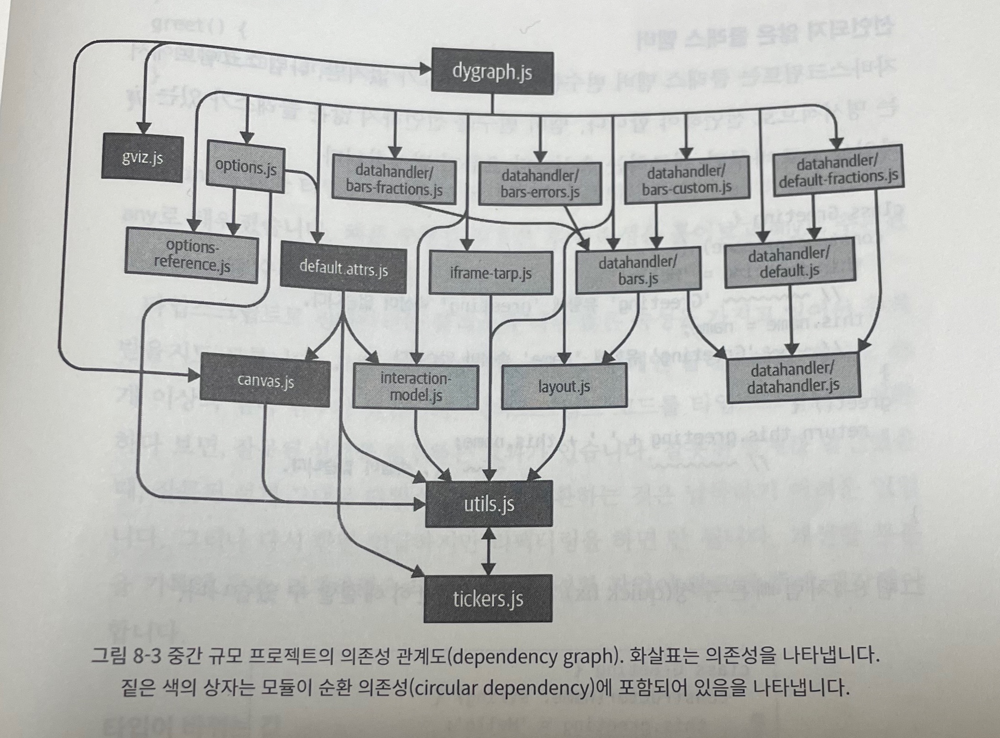

## 8장. 타입스크립트로 마이그레이션하기

### 아이템 58: 모던 자바스크립트로 작성하기

- 타입스크립트를 도입할 때 가장 중요한 기능은 ECMAScript 모듈과 ES2015 클래스

#### ECMAScript 모듈 사용하기

- ES2015부터는 import와 export를 사용하는 ECMAScript 모듈이 표준이 되었음
- 따라서 마이그레이션 대상을 ES 모듈로 전환하는 것이 좋음
- ES 모듈 시스템은 타입스크립트에서도 잘 동작하며, 모듈 단위로 전환할 수 있게 해주기 때문에 점진적 마이그레이션이 원활해짐
- CommonJS 모듈(require) 시스템 -> ES 모듈(import, export) 시스템으로 바꾸기

#### 프로토타입 대신 클래스 사용하기

- 과거 자바스크립트에서는 프로토타입 기반의 객체 모델을 사용했었음
- 그러나 견고한 클래스 모델이 더 선호되었기 때문에 ES2015에 class 키워드를 사용하는 클래스 기반 모델이 도입됨
- 프로토타입으로 구현한 객체보다 클래스로 구현한 객체 코드가 더 간결하고 직관적이기 때문에 타입스크립트의 클래스를 사용하여 코드를 작성하자

#### var 대신 let/const 사용하기

- const는 제대로 된 블록 스코프 규칙을 가지며, 개발자들이 일반적으로 기대하는 방식으로 동작하는 반면에 var는 스코프 문제(호이스팅)가 발생함
- var를 쓰면 호이스팅으로 인해 코드의 실행 순서를 예상하기 어렵게 됨

#### for(;;) 대신 for-of 또는 배열 메서드 사용하기

- 과거에는 for (let i = 0; i < 10; i++) 같은 C 스타일의 for 루프 사용
- 모던 자바스크립트에는 for-of 루프가 존재
  ```typescript
  for (const el of array) {
    // ...
  }
  ```
  - for-of 루프는 코드가 짧고, 인덱스 변수를 사용하지 않기에 실수를 줄일 수 있음
  - 인덱스 변수가 필요한 경우, forEach 메서드 사용
  - for-in 문법은 몇 가지 문제가 존재하기에 사용하지 않는 것이 좋음
- 즉, 인덱스가 필요한 순회 === forEach, 인덱스가 필요없는 순회 === for-of

#### 함수 표현식보다 화살표 함수 사용하기

- this는 일반적으로 인스턴스를 참조하는 것을 기대하지만, 함수 표현식에서의 this는 예상치못한 결과가 발생할 수도 있음
  ```typescript
  class Foo {
    method() {
      console.log(this);
      [1, 2].forEach(function (i) {
        console.log(this);
      });
    }
  }
  const f = new Foo();
  f.method();
  // strict 모드에서는 Foo, undefined, undefined
  // non-strict 모드에서는 Foo, window, window 출력!!! 결과가 다름
  ```
- 하지만 화살표 함수를 사용하면 상위 스코프의 this를 유지할 수 있음
  ```typescript
  class Foo {
    method() {
      console.log(this);
      [1, 2].forEach((i) => {
        console.log(this);
      });
    }
  }
  const f = new Foo();
  f.method();
  // 항상 Foo, Foo, Foo 출력
  // 예상한대로 출력됨
  ```
- 그리고 콜백함수에 대해서 화살표 함수가 더 직관적이고, 간결함
- 따라서 함수 표현식보다는 화살표 함수를 쓰는 것이 더 권장됨

#### 단축 객체 표현과 구조 분해 할당 사용하기

- 단축 객체 표현 예시

  ```typescript
  const x = 1,
    y = 2,
    z = 3;
  const pt = {
    x: x,
    y: y,
    z: z,
  };
  // 위 코드랑 같은 기능. 하지만 더 간결. 단축 객체 표현
  const pt = {
    x,
    y,
    z,
  };
  ```

  - 변수와 객체 속성의 이름이 같다면, 단축 객체 표현으로 간결하게 코드 작성 가능(회사에서 이미 사용하고 있고, 프리티어 속성으로 자동으로 잡아주는중. api 파라미터 넣어서 보낼 때에도 자주 사용하는 중)

- 객체 구조 분해 예시

  ```typescript
  const props = obj.props;
  const a = props.a;
  const b = props.b;

  // 위 코드를 아래처럼 바꾼 것이 객체 구조 분해
  const { props } = obj;
  const { a, b } = props;
  ```

- 단축 객체 표현과 객체 구조 분해 둘 다 문법이 간결해지고 변수를 사용할 때 실수를 줄일 수 있기 때문에 적극 사용 권장

#### 함수 매개변수 기본값 사용하기

- 자바스크립트에서 함수의 모든 매개변수는 선택적(생략 가능)이며, 매개변수를 지정하지 않으면 undefined로 간주됨
  ```javascript
  function log2(a, b) {
    console.log(a, b);
  }
  log2(); // undefined, undefined
  ```
- 모던 자바스크립트에서 매개변수에 기본값을 지정하는 방법
  ```javascript
  function parseNum(str, base = 10) {
    return parseInt(str, base);
    //
  }
  ```
  - 매개변수에 기본값 지정시, 코드가 간결해짐 + base가 선택적 매개변수라는 것을 명확히 나타내주는 효과도 있음
  - 또한 타입 추론에서 기본값을 기준으로 타입을 추론하기 때문에 매개변수의 타입 구문을 쓰지 않아도 됨

#### 저수준 프로미스나 콜백 대신 async/await 사용하기

- 콜백과 프로미스를 사용한 코드보다는 async, await으로 작성한 코드가 훨씬 깔끔하고 직관적

#### 타입스크립트에 use strict 넣지 않기

- ES5에서는 버그가 될 수 있는 코드 패턴에 오류를 표시해주는 **엄격 모드(use strict)**가 추가됨
- 허나 타입스크립트에서 수행되는 안전성 검사가 엄격 모드보다 훨씬 더 엄격한 체크를 하기 때문에 타입스크립트에서의 use stric는 무의미하다.
- 실제로는 타입스크립트 컴파일러가 생성하는 자바스크립트 코드에서 use strict가 추가됨
- 따라서 use strict를 쓰는 것이 아닌 컴파일러 옵션의 alwaysStrict 옵션을 사용해야 함

### 아이템 59: 타입스크립트 도입 전에 @ts-check와 JSDoc으로 시험해보기

- 타입스크립트로 변환하기 전, @ts-check 지시자를 사용하여 타입스크립트로 전환시에 어떤 문제가 발생하는지 미리 시험해 볼 수 있음
- @ts-check을 사용하여 타입 체커가 파일을 분석, 발견된 오류를 보고하도록 지시.대신 매우 느슨한 수준의 타입 체크. noImplicitAny 설정보다 더 헐거운 체크

- @ts-check로 찾아낼 수 있는 오류들
  - 선언되지 않은 전역 변수
    - let이나 const 같은 변수 선언이 아닌 script 태그 내의 숨어있는 변수들과 같은 경우를 탐지할 수 있음. 변수를 제대로 인식하게 하기 위해서는 declare 파일(types.d.ts) 선언하면 됨
  - 알 수 없는 라이브러리
    - 서드파티 라이브러리의 타입 정보에 대한 오류를 사전에 발견 가능.
    - 서드파티 라이브러리의 @types/library를 다운 받아서 해결 가능.
  - DOM 문제
    - HTMLInputElement 타입에는 있는 속성을 HTMLElement에서 사용하려고 하면 타입 오류가 남. 그리고 이와 같은 오류 타입을 사전에 발견할 수 있음
    - 타입 오류는 as 타입 단언문으로 해결 가능

### 아이템 60: allowJs로 타입스크립트와 자바스크립트 같이 사용하기

- 대규모 프로젝트는 한 번에 js -> ts로 마이그레이션이 불가능하기에 점진적으로 마이그레이션 해야 함. 따라서 js와 ts의 혼용이 가능해야 함
- 혼용이 가능하게 하는 방법: allowJs 컴파일러 옵션 -> ts, js 파일을 서로 임포트할 수 있게 해주는 옵션

### 아이템 61: 의존성 관계에 따라 모듈 단위로 전환하기

- 점진적 마이그레이션 할 때는 모듈 단위로 각개격파 하는 것이 이상적.
- 하지만 한 모듈에서의 타입 정보를 추가하면 이를 의존하고 있던 다른 모듈에서 타입 오류가 발생.
- 따라서 타입 오류가 없게 하려면 다른 모듈에 의존하지 않는 가장 하위 모듈부터 작업을 시작해서 의존성의 가장 최상단에 있는 모듈을 마지막으로 완성해야 함
- 일반적으로 프로젝트는 서드파티 라이브러리를 의존하고, 서드파티 라이브러리는 해당 프로젝트 모듈을 의존하지 않음 -> 즉, 서드파티 라이브러리의 타입 정보를 먼저 해결해야 함. -> @types install --dev 설치받는 걸로 해결 가능
   - 모듈 의존관계 그래프

- 가장 많이 의존 당하고 있고, 다른 모듈을 의존하고 있지는 않은 utils(최하단 모듈)의 타입을 가장 먼저 지정해줘야 함.

- 타입스크립트 마이그레이션 과정에서 참고해야 하는 오류들

  - 선언되지 않은 클래스 멤버

    - 자바스크립트는 클래스 멤버 변수를 선언할 필요가 없지만 타입스크립트에서는 클래스 멤버 변수를 명시적으로 선언해야 함
    - 멤버 변수를 선언하지 않으면 .js -> .ts로 바꿀 경우, 참조하는 속성마다 오류 발생
    - 마이그레이션 과정에서 클래스의 멤버 변수가 많을지라도 일일이 다 명시해줘야 함

  - 타입이 바뀌는 값

    ```typescript
    const state = {};
    state.name = "New York";
    // ~~~'{}' 유형에 'name' 속성이 없습니다
    state.capital = "Albany";
    // ~~~'{}' 유형에 'capital' 속성이 없습니다

    // 객체를 한 번에 생성해줌으로써 타입 에러 해결 가능
    const state = {
      name: "New York",
      capital: "Albany",
    }; // 정상

    // 하지만 객체를 한번에 생성하기 곤란한 경우, 임시방편으로 타입 단언문 사용
    interface State {
      name: string;
      capital: string;
    }
    const state = {} as State;
    state.name = "New York"; // 정상
    state.capital = "Albany"; // 정상
    ```

- 마이그레이션의 마지막 순서로 프로젝트 모듈들을 대부분 의존하고 있고, 프로젝트 모듈들이 의존하고 있지 않은 테스트 모듈(코드)에 대한 마이그레이션을 진행하면 된다.

### 아이템 62: 마이그레이션의 완성을 위해 noImplicitAny 설정하기

- ts 마이그레이션의 마지막 단계 -> **noImplicitAny 설정**
- noImplicitAny가 설정되지 않은 상태에서는 타입 선언에서 비롯되는 실제 오류가 숨어있음
- noImplicitAny 설정을 하지 않으면, 타입 체크가 매우 허술해짐
- noImplicitAny는 상당히 엄격한 타입 체크 강도를 가지고 있는 설정(strictNullChecks의 상위호환급)
- 최종적으로 **가장 강력한 설정은 "strict": true**
