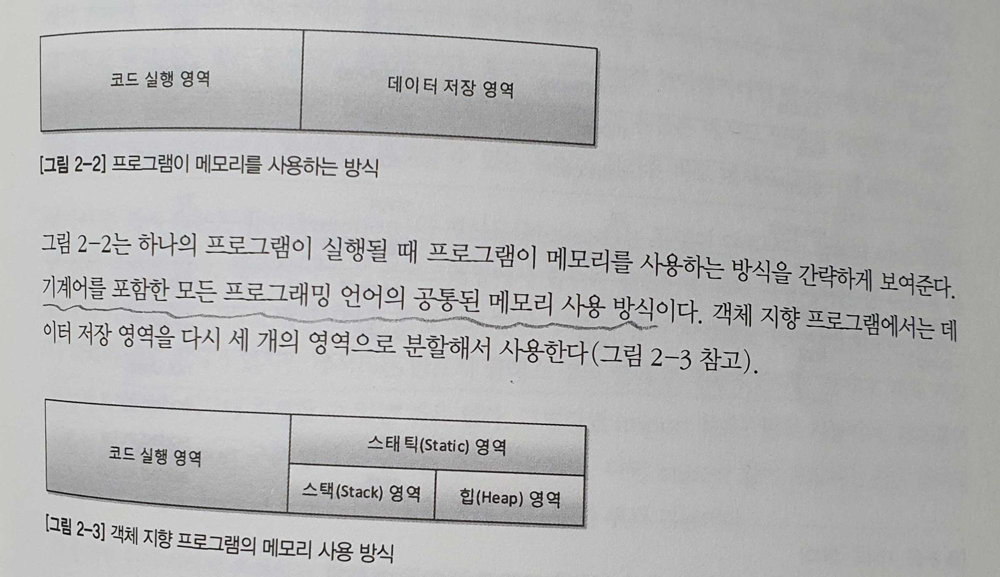

## 1. 사람을 사랑한 기술

#### 1-1. 신기술은 이전 기술의 어깨를 딛고

    - 신기술은 갑자기 하늘에서 뚝 떨어지는 것이 아니라 이전 기술의 어깨를 디딤돌 삼아 이전 기술을 거름 삼아 새로운 처학과 기법을 더해 나타난다.
    - 스프링은 과거에서 현재까지의 프로그래밍 발전사
    - 스프링을 학습하려면 이전 기술들을 마스터 해야 하는가? -> NO! 그저 이전 기술의 어깨를 딛기만 하면 됨.

#### 1-2. 기계어에서 객체 지향 프로그래밍 언어로

    - 프로그래밍 언어의 역사는 기계어에서 객체 지향 프로그래밍 언어로 진일보하게 발전해왔다.

    - 제일 초기의 프로그래밍 언어인 기계어는 0과 1로 프로그램을 작성했다. 최초의 프로그래머들은 키보드, 모니터, 마우스 없이 프로그래밍 한 것은 덤.

    - 어셈블리어: "기계어의 명령들을 일상 용어로 표현하고 이걸 기계가 알 수 있는 기계어로 번역하게 하면 어떨까?" 라는 관점에서 만들 최초의 인간 지향적 언어. 기계어 명령어와 일상 용어를 일대일로 매칭되는 코드표(어셈블리)를 생성. 허나 CPU 별로 기계어가 다르기 때문에 CPU 마다 어셈블리어도 달랐다. 게다가 각 어셈블리어들은 호환성이 없었기 때문에 각각의 어셈블리어를 별도로 학습해야하는 불편함도 있었다.

    - C 언어: C언어의 등장으로 소스 파일을 단 하나만 만들면 됨(싱글 소스). 기존에는 프로그램의 소스 파일을 각 기계의 종류만큼 만들어야 했음. C언어의 등장으로 하나의 소스 파일을 각 기계에 맞는 컴파일러로 컴파일만 하면 각 기계에 맞는 기계어 목적 파일이 만들어짐.

    - C++: C 언어에 객체 지향의 개념을 도입한 언어.

    - JAVA: 진정한 객체 지향 언어.  컴파일러를 기종별로 따로 구매해두지 않아도 됨. 자바 소스를 다른 기종의 컴퓨터에서 실행하기 위해 목적 파일인 오브젝트 파일 + 각 기종의 컴퓨터 운영체제에 해당하는 JRE가 설치되어 있으면 됨.

    - 객체 지향 방법론은 이름 그대로 방법론이며, 객체 지향을 기반으로 개발된 C++, JAVA, Spring 등을 알기 위해서는 객체 지향에 대한 깊은 이해는 필수 불가결하다

## 2. 자바와 절차적/ 구조적 프로그래밍

#### 2-1. 자바 프로그램의 객발과 구동

    - 현실 세계예서 컴퓨터를 구동하기 위해서는 물리적 컴푸터인 하드웨어와 운영체제, 그리고 그 위에서 구동될 소프트웨어가 필요함. + 소프트웨어를 개발할 수 있는 개발도구
    - 소프트웨어 개발 도구 -> JDK - 자바 개발 도구(JVM용 소프트웨어 개발 도구)
    - 운영체제 -> JRE - 자바 실행 환경(JVM용 OS)
    - 하드웨어(물리적 컴퓨터) -> JVM(Java Virtual Machine) 자바 가상 기계. 가상의 컴퓨터
    - 프로그램이 메모리를 사용하는 방식 -> 코드 실행 영역과 데이터 저장 영역으로 구성
    - 데이터 저장 영역을 다시 세 개의 영역으로 분할해서 사용.(스태틱 영역, 스택 영역, 힙  영역)
    - 

#### 2-2. 다시 보는 main() 메서드: 메서드 스택 프레임

    - 자바에서 main 메서드안의 System.out.println을 실행할 때, 메모리에서는 무슨 일이 일어날까?
    - JRE는 프로그램 안에 main 메서드가 있는지 확인한다.
    - main 메서드의 존재가 확인되면, JRE는 프로그램 실행을 위한 사전 준비에 착수
    - JVM을 부팅하여 목적 파일을 JVM에서 실행.
    - println을 실행하기 위해 java.lang 패키지를 메모리의 스태틱 영역에 가져다 놓음.(System.out.println 메서드를 실행하기 위한 사전 준비)
    - 개발자가 작성한 모든 클래스와 패키지를 스태틱 영역에 가져다 놓음
    - main 메서드의 스택 프레임이 스택 메모리 영역에 할당됨.
    - 메서드의 인자 args를 저장할 변수 공간을 스택 프레임의 맨 밑에 확보해서 변수 공간을 할당한다.
    - 닫는 중괄호를 만나면 스택 프레임이 소멸된다.
    - main 메서드가 끝나면 JRE는 JVM을 종료하고, JRE 자체도 운영체제 상의 메모리에서 사라짐

#### 2-3. 전역 변수와 메모리

    - 두 메서드 사이에 값을 공유하기 위해서 전역 변수를 사용함.
    - 자바 코드에서 static 키워드가 붙은 변수는 메모리에서 스태틱 영역에 변수 공간이 할당된다.
    - 따라서 스택 메모리의 스택 프레임 안에서 스태틱 영역에 존재하는 변수 값들을 전역적으로 가져다가 쓸 수 있다.
    - 프로젝트와 코드의 규모가 커지면서 여러 메서드에서 전역 변수의 값을 변경하기 시작하면 메모리로 전역 변수를 추적하지 않는 이상, 전역 변수에 저장돼 있는 값을 파악하기 쉽지 않기 때문에 전역 변수의 사용을 지양한다.
    - 따라서 전역 변수의 사용은 전역적으로 사용하는 변하지 않는 값(상수)를 사용할 때, 주로 사용하는 것이 바람직하다(ex: Math 클래스의 PI 값)

#### 2-4. 멀티 스레드 / 멀티 프로세스의 이해

    -

## 3. 자바와 객체 지향

## 4. 자바와 확장한 객체 지향

## 5. 객체지향 설계 5원칙 - SOLID

## 6. 스프링이 사랑한 디자인 패턴

## 7. 스프링 삼각형과 설정 정보

## 8. 스프링 MVC를 이용한 게시판 구축

## 9. 자바 8 함다와 인터페이스 스펙 변화
